**THE NEXTX** **- ĐẤU TRƯỜNG AI KINH DOANH 2026**

BÁO CÁO DỰ ÁN VÒNG 2

**“CONTRACTGUARD”**

**TRỢ LÝ AI BẢO VỆ NGƯỜI DÂN TRƯỚC RỦI RO PHÁP LÝ TRONG HỢP ĐỒNG**

LĨNH VỰC DỰ THI: CÔNG NGHỆ - CHUYỂN ĐỔI SỐ

ĐỘI THI: FACTCHECK AI

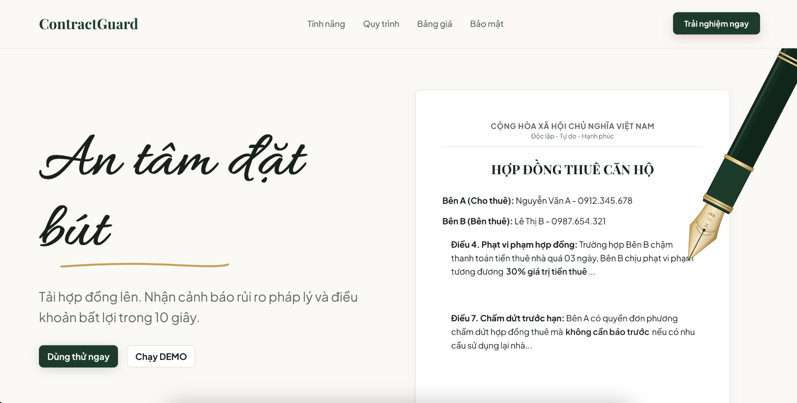

*Hình bìa: Giao diện trang đầu prototype ContractGuard.*

tháng 7 năm 2026

# MỤC LỤC

- PHẦN I: LÀM RÕ VẤN ĐỀ VÀ MỤC TIÊU DỰ ÁN
- PHẦN II: CƠ SỞ LÝ LUẬN, THỊ TRƯỜNG VÀ BẰNG CHỨNG DỮ LIỆU
- PHẦN III: CHÂN DUNG KHÁCH HÀNG, MOM TEST VÀ INSIGHT KHẢO SÁT
- PHẦN IV: GIẢI PHÁP KỸ THUẬT VÀ PROTOTYPE / DEMO CONCEPT
- PHẦN V: MÔ HÌNH KINH DOANH, TÀI CHÍNH VÀ SCALABILITY
- PHẦN VI: KHẢ NĂNG HỌC HỎI VÀ ĐIỀU CHỈNH
- PHẦN VII: VẬN HÀNH TEAM, RỦI RO VÀ HƯỚNG PHÁT TRIỂN
- PHẦN VIII: TÀI LIỆU THAM KHẢO VÀ PHỤ LỤC

# PHẦN I: LÀM RÕ VẤN ĐỀ VÀ MỤC TIÊU DỰ ÁN

## 1. Lý do chọn đề tài

Trong đời sống dân sự và tài chính, hợp đồng là văn bản quyết định trực tiếp quyền lợi và nghĩa vụ của người ký. Tuy nhiên, phần lớn người dân không có nền tảng pháp lý để đọc hiểu toàn bộ điều khoản trước khi đặt bút ký. Hợp đồng thuê nhà, bảo hiểm, vay vốn, hợp đồng kỳ nghỉ hoặc hợp đồng lao động thường dài, nhiều thuật ngữ và có thể chứa những điều khoản bất lợi được viết bằng ngôn ngữ khó hiểu.

Vấn đề nghiêm trọng hơn ở người lớn tuổi, người ít hiểu công nghệ và người thiếu kỹ năng sử dụng AI. Họ có nhu cầu giao dịch thật nhưng không biết viết prompt, không biết kiểm chứng câu trả lời và dễ tin vào lời tư vấn một chiều. Trong khi đó, sinh viên và người mới đi làm thường ký hợp đồng trong trạng thái vội, ít kinh nghiệm, nên dễ mất tiền cọc hoặc chịu điều khoản bất lợi. Khoảng trống này tạo cơ hội cho một công cụ chuyên biệt, dễ dùng, chi phí thấp, bảo mật và bám sát pháp luật Việt Nam.

## 2. Problem Statement

Câu hỏi trọng tâm của ContractGuard được xác định như sau:

*“Làm thế nào để người không có kiến thức pháp lý hoặc không giỏi công nghệ có thể kiểm tra nhanh các rủi ro trong hợp đồng trước khi ký, nhằm tránh mất tiền, bị ràng buộc bởi điều khoản bất lợi hoặc trở thành nạn nhân của các giao dịch lừa đảo?”*

Vấn đề này quan trọng vì hợp đồng là điểm “chốt” của một giao dịch. Khi đã ký, người dùng thường khó sửa lại điều khoản, khó chứng minh mình đã bị tư vấn sai, và có thể chịu thiệt hại trực tiếp bằng tiền thật như mất cọc, phí phạt, lãi chậm trả, phí thường niên hoặc mất quyền chấm dứt hợp đồng.

## 3. Đối tượng gặp vấn đề

- Khách hàng cá nhân: người lớn tuổi, người ít hiểu công nghệ, sinh viên, người mới đi làm, người đang thuê nhà hoặc chuẩn bị ký hợp đồng lao động. Điểm chung của nhóm này là thiếu thời gian, kiến thức pháp lý hoặc khả năng viết prompt và kiểm chứng câu trả lời của AI đại trà.
- Khách hàng tổ chức trong giai đoạn sau: doanh nghiệp vừa và nhỏ, phòng pháp chế và đơn vị bất động sản có hợp đồng lặp lại. Chỉ phát triển nhánh này sau khi MVP B2C được kiểm chứng bằng dữ liệu sử dụng thật.

## 4. Giá trị nếu ý tưởng thành công

<table style="border-collapse: collapse; width: 100%; border: 1px solid #dddddd; margin-bottom: 16px;">
  <tr>
    <th style="border: 1px solid #dddddd; padding: 8px; text-align: left; background-color: #124A38; color: #ffffff"><strong>Bên hưởng lợi</strong></th>
    <th style="border: 1px solid #dddddd; padding: 8px; text-align: left; background-color: #124A38; color: #ffffff"><strong>Giá trị nhận được</strong></th>
  </tr>
  <tr>
    <td style="border: 1px solid #dddddd; padding: 8px; text-align: left">Người dân phổ thông</td>
    <td style="border: 1px solid #dddddd; padding: 8px; text-align: left">Hiểu hợp đồng nhanh hơn, biết chỗ nào nguy hiểm, có câu hỏi/câu sửa để đàm phán trước khi ký.</td>
  </tr>
  <tr>
    <td style="border: 1px solid #dddddd; padding: 8px; text-align: left; background-color: #FAFAFA">Người cao tuổi/ít hiểu công nghệ</td>
    <td style="border: 1px solid #dddddd; padding: 8px; text-align: left; background-color: #FAFAFA">Không cần viết prompt; có thể nhờ người thân xem báo cáo PDF; giảm nguy cơ bị dẫn dắt bởi lời tư vấn một chiều.</td>
  </tr>
  <tr>
    <td style="border: 1px solid #dddddd; padding: 8px; text-align: left">Sinh viên/người mới đi làm</td>
    <td style="border: 1px solid #dddddd; padding: 8px; text-align: left">Kiểm tra nhanh hợp đồng thuê nhà/lao động với chi phí thấp, giảm nguy cơ mất cọc hoặc chịu phạt vô lý.</td>
  </tr>
  <tr>
    <td style="border: 1px solid #dddddd; padding: 8px; text-align: left; background-color: #FAFAFA">Doanh nghiệp</td>
    <td style="border: 1px solid #dddddd; padding: 8px; text-align: left; background-color: #FAFAFA">Giảm thời gian rà soát bước đầu, để đội ngũ pháp lý tập trung vào điều khoản phức tạp và quyết định cuối cùng.</td>
  </tr>
</table>

## 5. Phạm vi MVP

MVP tập trung vào hợp đồng thuê nhà vì dễ chứng minh: có tiền cọc, thời hạn thanh toán, nghĩa vụ sửa chữa, chấm dứt trước hạn, quyền kiểm tra nhà và phí phát sinh. Giai đoạn tiếp theo mở rộng sang bảo hiểm, vay vốn, hợp đồng kỳ nghỉ và hợp đồng lao động.

**6. Mục tiêu và phương pháp thực hiện**

Mục tiêu của dự án là xây dựng một AI Legal Assistant dành cho người dùng phổ thông tại Việt Nam, có khả năng đọc, phát hiện rủi ro, giải thích điều khoản bằng ngôn ngữ đời thường và đề xuất hành động cụ thể trước khi ký. Trong MVP, nhóm ưu tiên: hỗ trợ PDF/DOCX/ảnh; phân loại Đỏ - Vàng - Xanh; highlight đoạn gốc; đề xuất câu sửa; và ẩn dữ liệu cá nhân trước khi AI xử lý.

Nhóm kết hợp bốn phương pháp: (1) phân tích - tổng hợp tài liệu, số liệu thị trường và mẫu hợp đồng; (2) phỏng vấn khách hàng theo The Mom Test, tập trung vào hành vi quá khứ và thiệt hại thật; (3) thiết kế prototype theo luồng demo 60 giây; (4) kiểm thử bằng hợp đồng có cài bẫy để đo khả năng phát hiện rủi ro, độ chính xác highlight và mức dễ hiểu của lời giải thích.

# PHẦN II: CƠ SỞ LÝ LUẬN, THỊ TRƯỜNG VÀ BẰNG CHỨNG DỮ LIỆU

## 1. Cơ sở lý luận của giải pháp

Trí tuệ nhân tạo, đặc biệt là mô hình ngôn ngữ lớn, có khả năng trích xuất, phân loại, tóm tắt và giải thích văn bản dài. Trong lĩnh vực hợp đồng, AI có thể hỗ trợ nhận diện điều khoản, đối chiếu checklist pháp lý và chuyển ngôn ngữ chuyên môn thành ngôn ngữ đời thường. Tuy nhiên, vì kết quả liên quan trực tiếp đến quyền lợi tài chính và pháp lý, hệ thống phải có cơ chế giảm ảo giác, dẫn chiếu căn cứ và giới hạn trách nhiệm rõ ràng.

ContractGuard nằm ở giao điểm của LegalTech và RegTech: vừa hỗ trợ người dân đọc hiểu hợp đồng, vừa kiểm tra các điểm mơ hồ, bất lợi hoặc có dấu hiệu không phù hợp quy định. Triết lý Zero-Prompt giúp người dùng chỉ cần tải/chụp hợp đồng; checklist, lệnh phân tích và cấu trúc báo cáo đã được chuẩn hóa ở phía hệ thống. Bảo mật được coi là tính năng lõi thông qua ẩn danh dữ liệu nhạy cảm trước khi xử lý và định hướng xóa file sau phân tích.

## 2. Vì sao đây là bài toán có thị trường thật?

Thị trường của ContractGuard không được chứng minh bằng quy mô LegalTech toàn cầu hay số người dùng Internet một cách chung chung, mà bằng hai lớp dữ liệu: (1) nỗi đau trực tiếp từ người dùng thật và (2) xu hướng số hóa hợp đồng/tuân thủ đang tăng trong khu vực. Ở lớp người dùng, ba tín hiệu quan trọng là: người dùng thường xuyên phải ký hợp đồng, hành vi đọc hiện tại tạo ra rủi ro đo được và một bộ phận sẵn sàng trả phí để giảm rủi ro. Nhóm kết hợp khảo sát 167 người với dữ liệu chính thức về bảo hiểm, bảo vệ người tiêu dùng và hợp đồng nghỉ dưỡng để xác định phân khúc, tính năng và thứ tự phát triển sản phẩm. [3]

Ở lớp dung lượng thị trường, Việt Nam và Đông Nam Á có nền tảng tiếp nhận sản phẩm số rất lớn: e-Conomy SEA 2025 ghi nhận kinh tế số Đông Nam Á vượt 300 tỷ USD GMV; Việt Nam được dự báo đạt 36 tỷ USD kinh tế số năm 2024 và Chính phủ đặt mục tiêu kinh tế số đóng góp 30% GDP năm 2030. Ở lớp ngành chuyên biệt, LegalTech toàn cầu được dự báo tăng từ 38,67 tỷ USD năm 2026 lên 71,95 tỷ USD năm 2031; riêng nhóm Contract Lifecycle Management tăng 18,35%/năm, còn RegTech Châu Á - Thái Bình Dương tăng 20,77%/năm đến 2030. Vì vậy, ContractGuard nằm trong giao điểm có dung lượng thật: số hóa hợp đồng, nhu cầu tuân thủ, bảo vệ người tiêu dùng và AI có căn cứ pháp lý. [11], [12], [13], [14], [15]

<table style="border-collapse: collapse; width: 100%; border: 1px solid #dddddd; margin-bottom: 16px;">
  <tr>
    <th style="border: 1px solid #dddddd; padding: 8px; text-align: left; background-color: #124A38; color: #ffffff"><strong>Tín hiệu dữ liệu trực tiếp</strong></th>
    <th style="border: 1px solid #dddddd; padding: 8px; text-align: left; background-color: #124A38; color: #ffffff"><strong>Kết quả chính</strong></th>
    <th style="border: 1px solid #dddddd; padding: 8px; text-align: left; background-color: #124A38; color: #ffffff"><strong>Phân tích dữ liệu</strong></th>
    <th style="border: 1px solid #dddddd; padding: 8px; text-align: left; background-color: #124A38; color: #ffffff"><strong>Quyết định áp dụng vào sản phẩm</strong></th>
  </tr>
  <tr>
    <td style="border: 1px solid #dddddd; padding: 8px; text-align: left">Mức độ tiếp xúc với hợp đồng</td>
    <td style="border: 1px solid #dddddd; padding: 8px; text-align: left">81,2% mẫu khảo sát đã từng ký ít nhất một nhóm hợp đồng được hỏi: thuê nhà 49,3%; bảo hiểm 43,5%; sở hữu kỳ nghỉ/thẻ dài hạn 29,0%; tài chính-vay vốn 24,6%.</td>
    <td style="border: 1px solid #dddddd; padding: 8px; text-align: left">Nhu cầu không phải giả định. Thuê nhà có độ phủ cao nhất trong mẫu và cấu trúc điều khoản tương đối chuẩn hóa, phù hợp để kiểm thử MVP.</td>
    <td style="border: 1px solid #dddddd; padding: 8px; text-align: left">Giữ hợp đồng thuê nhà là use case đầu tiên; bảo hiểm là hướng mở rộng thứ hai; tài chính và kỳ nghỉ chỉ triển khai khi checklist đủ sâu. [3]</td>
  </tr>
  <tr>
    <td style="border: 1px solid #dddddd; padding: 8px; text-align: left; background-color: #FAFAFA">Hành vi trước khi ký</td>
    <td style="border: 1px solid #dddddd; padding: 8px; text-align: left; background-color: #FAFAFA">63,8% từng ký ngay vì tin tưởng hoặc bị thúc giục; 59,4% chỉ đọc thông tin cốt lõi; chỉ 39,1% cho biết đã đọc kỹ từng điều khoản.</td>
    <td style="border: 1px solid #dddddd; padding: 8px; text-align: left; background-color: #FAFAFA">Điểm nghẽn không phải thiếu văn bản, mà là thiếu thời gian và khả năng xác định nhanh câu nào nguy hiểm. Một báo cáo dài sẽ không giải quyết đúng hành vi.</td>
    <td style="border: 1px solid #dddddd; padding: 8px; text-align: left; background-color: #FAFAFA">Ưu tiên Zero-Prompt, tóm tắt rủi ro trong một màn hình và đánh dấu trực tiếp Đỏ-Vàng-Xanh trên đoạn gốc. [3]</td>
  </tr>
  <tr>
    <td style="border: 1px solid #dddddd; padding: 8px; text-align: left">Cách xử lý hiện tại</td>
    <td style="border: 1px solid #dddddd; padding: 8px; text-align: left">79,7% từng bỏ qua và ký liều; 78,3% nhờ người thân/bạn bè; 40,6% tự tra Google hoặc Facebook Groups.</td>
    <td style="border: 1px solid #dddddd; padding: 8px; text-align: left">Các giải pháp thay thế hiện tại phụ thuộc người quen và thông tin rời rạc. Việc người dùng thường nhờ người thân cũng cho thấy kết quả cần dễ chia sẻ.</td>
    <td style="border: 1px solid #dddddd; padding: 8px; text-align: left">Bổ sung xuất PDF/chia sẻ báo cáo; mỗi cảnh báo phải có câu hỏi hoặc câu sửa để người dùng dùng ngay khi thương lượng. [3]</td>
  </tr>
  <tr>
    <td style="border: 1px solid #dddddd; padding: 8px; text-align: left; background-color: #FAFAFA">Thiệt hại tài chính</td>
    <td style="border: 1px solid #dddddd; padding: 8px; text-align: left; background-color: #FAFAFA">58,0% người trả lời cho biết từng chịu thiệt hại ở một mức nào đó; 34,8% cho biết mức thiệt hại lớn nhất trên 5 triệu đồng.</td>
    <td style="border: 1px solid #dddddd; padding: 8px; text-align: left; background-color: #FAFAFA">Nỗi đau có thể quy đổi thành tiền. Giá trị sản phẩm nằm ở khoản thiệt hại có thể tránh được, không nằm ở số trang AI đã đọc.</td>
    <td style="border: 1px solid #dddddd; padding: 8px; text-align: left; background-color: #FAFAFA">Action Card phải hiển thị hậu quả, khoản tiền có nguy cơ, mức ưu tiên và hành động tiếp theo. [3]</td>
  </tr>
  <tr>
    <td style="border: 1px solid #dddddd; padding: 8px; text-align: left">Khả năng trả phí</td>
    <td style="border: 1px solid #dddddd; padding: 8px; text-align: left">65,2% chọn mức 29.000-99.000đ/lần; 33,3% chỉ dùng nếu miễn phí; 1,4% không sử dụng.</td>
    <td style="border: 1px solid #dddddd; padding: 8px; text-align: left">Nhu cầu trả phí có tín hiệu nhưng chưa phải giao dịch thật. Mức thấp nhất 29.000đ phù hợp để kiểm chứng, trong khi Free Scan cần thiết để tạo niềm tin.</td>
    <td style="border: 1px solid #dddddd; padding: 8px; text-align: left">Thử nghiệm Freemium: quét nhanh miễn phí, báo cáo đầy đủ từ 29.000đ; chỉ điều chỉnh giá sau khi có giao dịch thật. [3]</td>
  </tr>
  <tr>
    <td style="border: 1px solid #dddddd; padding: 8px; text-align: left; background-color: #FAFAFA">Quy mô hợp đồng bảo hiểm</td>
    <td style="border: 1px solid #dddddd; padding: 8px; text-align: left; background-color: #FAFAFA">Bộ Tài chính ghi nhận 11.441.220 hợp đồng bảo hiểm đang có hiệu lực vào tháng 10/2025; 8 tháng đầu năm 2025 có 1.161.502 hợp đồng khai thác mới.</td>
    <td style="border: 1px solid #dddddd; padding: 8px; text-align: left; background-color: #FAFAFA">Bảo hiểm có số hợp đồng lớn và phát sinh liên tục. Trong khảo sát, 89,9% thấy văn bản bảo hiểm/vay vốn dài, phức tạp và 85,5% khó hiểu điều khoản loại trừ hoặc phí phạt.</td>
    <td style="border: 1px solid #dddddd; padding: 8px; text-align: left; background-color: #FAFAFA">Sau MVP thuê nhà, xây checklist bảo hiểm tập trung vào loại trừ, thời gian chờ, nghĩa vụ kê khai, phí, hoàn tiền và chấm dứt. [4], [5]</td>
  </tr>
  <tr>
    <td style="border: 1px solid #dddddd; padding: 8px; text-align: left">Rủi ro hợp đồng nghỉ dưỡng dài hạn</td>
    <td style="border: 1px solid #dddddd; padding: 8px; text-align: left">Ủy ban Cạnh tranh Quốc gia cho biết người mua thường trả trước 200-800 triệu đồng, có thể chịu thêm phí duy trì, thường niên, chuyển nhượng và trao đổi; hợp đồng kéo dài từ vài năm đến vài chục năm.</td>
    <td style="border: 1px solid #dddddd; padding: 8px; text-align: left">Tần suất trong mẫu thấp hơn thuê nhà và bảo hiểm, nhưng mức thiệt hại tiềm năng rất cao và điều khoản phức tạp. Đây không phù hợp với gói quét nhanh giá thấp.</td>
    <td style="border: 1px solid #dddddd; padding: 8px; text-align: left">Xếp vào gói Deep Scan sau MVP; bắt buộc kiểm tra phí suốt thời hạn, quyền hủy/chấm dứt, chuyển nhượng, đặt phòng và nghĩa vụ của bên bán. [6]</td>
  </tr>
  <tr>
    <td style="border: 1px solid #dddddd; padding: 8px; text-align: left; background-color: #FAFAFA">Cảnh báo nóng từ Bộ Công an</td>
    <td style="border: 1px solid #dddddd; padding: 8px; text-align: left; background-color: #FAFAFA">Ngày 04/07/2026, Bộ Công an cho biết Công an Hà Nội và TP.HCM đã tiếp nhận khoảng 2.500 đơn liên quan hợp đồng kỳ nghỉ; khởi tố 40 vụ án, 525 bị can; số tiền bị chiếm đoạt bước đầu khoảng 2.600 tỷ đồng.</td>
    <td style="border: 1px solid #dddddd; padding: 8px; text-align: left; background-color: #FAFAFA">Đây không còn là rủi ro cá biệt mà là dạng lừa đảo có tổ chức, đánh vào người có điều kiện tài chính, người trung niên và người cao tuổi bằng tác động tâm lý, quà tặng và lời hứa sinh lời.</td>
    <td style="border: 1px solid #dddddd; padding: 8px; text-align: left; background-color: #FAFAFA">Bổ sung bộ dấu hiệu cảnh báo lừa đảo: mời hội thảo/quà tặng, yêu cầu đặt cọc ngay, cam kết lợi nhuận hoặc chuyển nhượng dễ dàng, thông tin pháp nhân và tài sản nghỉ dưỡng không rõ. Với dấu hiệu nghiêm trọng, hệ thống phải khuyến nghị dừng ký và liên hệ cơ quan Công an. [8]</td>
  </tr>
  <tr>
    <td style="border: 1px solid #dddddd; padding: 8px; text-align: left">Nhu cầu hỗ trợ người tiêu dùng</td>
    <td style="border: 1px solid #dddddd; padding: 8px; text-align: left">Năm 2024, Tổng đài 1800.6838 trả lời 5.536 cuộc gọi; 65,5% liên quan tư vấn/hỗ trợ bảo vệ người tiêu dùng; Ủy ban Cạnh tranh Quốc gia tiếp nhận 787 đơn, thư phản ánh và khiếu nại.</td>
    <td style="border: 1px solid #dddddd; padding: 8px; text-align: left">Số liệu không chỉ riêng hợp đồng nên không dùng để tính TAM. Tuy nhiên, nó chứng minh nhu cầu được hướng dẫn và chuyển tiếp khi tranh chấp là có thật.</td>
    <td style="border: 1px solid #dddddd; padding: 8px; text-align: left">Báo cáo phải ghi rõ giới hạn AI, hướng dẫn lưu bằng chứng và khuyến nghị chuyển luật sư/cơ quan phù hợp với rủi ro nghiêm trọng. [7]</td>
  </tr>
</table>

### 2.1. Kết luận hoạch định sản phẩm từ dữ liệu

Dữ liệu cho thấy không nên phát triển đồng thời mọi loại hợp đồng. Nhóm sử dụng ba tiêu chí để ưu tiên: tần suất trong mẫu khảo sát, mức thiệt hại tiềm năng và độ phức tạp để triển khai chính xác.

<table style="border-collapse: collapse; width: 100%; border: 1px solid #dddddd; margin-bottom: 16px;">
  <tr>
    <th style="border: 1px solid #dddddd; padding: 8px; text-align: left; background-color: #124A38; color: #ffffff"><strong>Nhóm hợp đồng</strong></th>
    <th style="border: 1px solid #dddddd; padding: 8px; text-align: left; background-color: #124A38; color: #ffffff"><strong>Bằng chứng nhu cầu</strong></th>
    <th style="border: 1px solid #dddddd; padding: 8px; text-align: left; background-color: #124A38; color: #ffffff"><strong>Mức ưu tiên</strong></th>
    <th style="border: 1px solid #dddddd; padding: 8px; text-align: left; background-color: #124A38; color: #ffffff"><strong>Phạm vi sản phẩm</strong></th>
  </tr>
  <tr>
    <td style="border: 1px solid #dddddd; padding: 8px; text-align: left">Thuê nhà</td>
    <td style="border: 1px solid #dddddd; padding: 8px; text-align: left">49,3% mẫu từng ký; rủi ro cọc, chấm dứt và chi phí phát sinh xuất hiện rõ trong khảo sát.</td>
    <td style="border: 1px solid #dddddd; padding: 8px; text-align: left">Ưu tiên 1 – MVP</td>
    <td style="border: 1px solid #dddddd; padding: 8px; text-align: left">Quét nhanh; đánh dấu cọc, báo trước, sửa chữa, điện nước và chấm dứt.</td>
  </tr>
  <tr>
    <td style="border: 1px solid #dddddd; padding: 8px; text-align: left">Bảo hiểm</td>
    <td style="border: 1px solid #dddddd; padding: 8px; text-align: left">43,5% mẫu từng ký; hơn 11,4 triệu hợp đồng đang hiệu lực; mức khó hiểu điều khoản rất cao.</td>
    <td style="border: 1px solid #dddddd; padding: 8px; text-align: left">Ưu tiên 2</td>
    <td style="border: 1px solid #dddddd; padding: 8px; text-align: left">Checklist chuyên biệt; tập trung loại trừ, thời gian chờ, kê khai, phí và hoàn tiền.</td>
  </tr>
  <tr>
    <td style="border: 1px solid #dddddd; padding: 8px; text-align: left">Tài chính/vay vốn</td>
    <td style="border: 1px solid #dddddd; padding: 8px; text-align: left">24,6% mẫu từng ký; giá trị rủi ro cao nhưng yêu cầu căn cứ và tính toán chính xác.</td>
    <td style="border: 1px solid #dddddd; padding: 8px; text-align: left">Ưu tiên 3</td>
    <td style="border: 1px solid #dddddd; padding: 8px; text-align: left">Chỉ thử nghiệm sau khi có dữ liệu pháp lý và bộ test đủ mạnh.</td>
  </tr>
  <tr>
    <td style="border: 1px solid #dddddd; padding: 8px; text-align: left">Nghỉ dưỡng dài hạn</td>
    <td style="border: 1px solid #dddddd; padding: 8px; text-align: left">29,0% mẫu từng ký; giá trị trả trước có thể 200-800 triệu đồng. Bộ Công an ghi nhận khoảng 2.500 đơn liên quan, thiệt hại bước đầu khoảng 2.600 tỷ đồng. [6], [8]</td>
    <td style="border: 1px solid #dddddd; padding: 8px; text-align: left">Ưu tiên 3 – Deep Scan</td>
    <td style="border: 1px solid #dddddd; padding: 8px; text-align: left">Gói phân tích sâu; kiểm tra dấu hiệu lừa đảo, pháp nhân, quyền sở hữu/khai thác, phí dài hạn, chuyển nhượng và quyền hủy; khuyến nghị dừng ký với rủi ro Đỏ.</td>
  </tr>
</table>

Kết luận: Trong 6 tháng đầu, ContractGuard chỉ cần chứng minh tốt một luồng hợp đồng thuê nhà. Chỉ mở rộng sang bảo hiểm khi đạt độ phát hiện tối thiểu 85% trên bộ test, tỷ lệ người dùng hoàn tất quét ổn định và có giao dịch trả phí thật. Hai nhóm tài chính và nghỉ dưỡng được giữ ở roadmap, không đưa vào MVP để tránh phân tán nguồn lực và tăng rủi ro sai pháp lý.

## 3. Ý tưởng này đã được ai thử chưa?

Lợi thế của ContractGuard không nằm ở việc sử dụng một mô hình ngôn ngữ “thông minh hơn” AI đại trà, mà ở việc biến AI thành một quy trình kiểm tra hợp đồng có cấu trúc. AI tạo sinh thông thường chỉ phản hồi theo câu hỏi người dùng; chất lượng thay đổi theo prompt và người dùng phải tự tìm lại điều khoản gốc. ContractGuard chuẩn hóa đầu vào, checklist, căn cứ, vị trí câu chữ và hành động tiếp theo. Sản phẩm không thay thế luật sư mà thực hiện bước sàng lọc ban đầu nhanh, nhất quán và có thể chuyển tiếp cho chuyên gia khi rủi ro cao.

<table style="border-collapse: collapse; width: 100%; border: 1px solid #dddddd; margin-bottom: 16px;">
  <tr>
    <th style="border: 1px solid #dddddd; padding: 8px; text-align: left; background-color: #124A38; color: #ffffff"><strong>Tiêu chí</strong></th>
    <th style="border: 1px solid #dddddd; padding: 8px; text-align: left; background-color: #124A38; color: #ffffff"><strong>ContractGuard</strong></th>
    <th style="border: 1px solid #dddddd; padding: 8px; text-align: left; background-color: #124A38; color: #ffffff"><strong>AI tạo sinh đại trà ( chatgpt, gemini,..)</strong></th>
    <th style="border: 1px solid #dddddd; padding: 8px; text-align: left; background-color: #124A38; color: #ffffff"><strong>Luật sư/truyền thống</strong></th>
  </tr>
  <tr>
    <td style="border: 1px solid #dddddd; padding: 8px; text-align: left">Điểm bắt đầu</td>
    <td style="border: 1px solid #dddddd; padding: 8px; text-align: left">Người dùng chỉ tải/chụp hợp đồng; hệ thống tự xác định loại hợp đồng và chạy quy trình kiểm tra.</td>
    <td style="border: 1px solid #dddddd; padding: 8px; text-align: left">Người dùng phải biết hỏi gì, viết prompt và chia nhỏ yêu cầu; câu hỏi thiếu có thể dẫn đến bỏ sót.</td>
    <td style="border: 1px solid #dddddd; padding: 8px; text-align: left">Người dùng gửi hồ sơ, mô tả nhu cầu và chờ chuyên gia tiếp nhận.</td>
  </tr>
  <tr>
    <td style="border: 1px solid #dddddd; padding: 8px; text-align: left; background-color: #FAFAFA">Cách phân tích</td>
    <td style="border: 1px solid #dddddd; padding: 8px; text-align: left; background-color: #FAFAFA">OCR/Parser → ẩn PII → checklist theo loại hợp đồng → RAG pháp lý → phân loại rủi ro → ánh xạ về đoạn gốc.</td>
    <td style="border: 1px solid #dddddd; padding: 8px; text-align: left; background-color: #FAFAFA">Mô hình sinh câu trả lời trực tiếp từ prompt; không mặc định có checklist đầy đủ, quy trình ánh xạ hoặc kiểm tra đúng hệ thống pháp luật.</td>
    <td style="border: 1px solid #dddddd; padding: 8px; text-align: left; background-color: #FAFAFA">Chuyên gia đọc và đánh giá theo kinh nghiệm; phù hợp giao dịch phức tạp nhưng khó mở rộng cho hợp đồng nhỏ.</td>
  </tr>
  <tr>
    <td style="border: 1px solid #dddddd; padding: 8px; text-align: left">Khả năng chống bỏ sót</td>
    <td style="border: 1px solid #dddddd; padding: 8px; text-align: left">Mỗi loại hợp đồng có bộ hạng mục bắt buộc; kết quả được kiểm thử bằng hợp đồng cài bẫy và ghi nhận tỷ lệ phát hiện.</td>
    <td style="border: 1px solid #dddddd; padding: 8px; text-align: left">Kết quả thay đổi theo cách hỏi; người dùng không biết điều khoản nào để hỏi thì AI có thể không phân tích điều khoản đó.</td>
    <td style="border: 1px solid #dddddd; padding: 8px; text-align: left">Độ sâu cao khi đúng chuyên gia, nhưng phụ thuộc phạm vi công việc, thời gian và chi phí.</td>
  </tr>
  <tr>
    <td style="border: 1px solid #dddddd; padding: 8px; text-align: left; background-color: #FAFAFA">Hiển thị bằng chứng</td>
    <td style="border: 1px solid #dddddd; padding: 8px; text-align: left; background-color: #FAFAFA">Split-view đánh dấu chính xác câu Đỏ-Vàng-Xanh; mỗi thẻ có đoạn gốc, căn cứ và độ tin cậy.</td>
    <td style="border: 1px solid #dddddd; padding: 8px; text-align: left; background-color: #FAFAFA">Thường trả văn bản tổng hợp; người dùng phải tự dò lại hợp đồng và tự kiểm chứng căn cứ.</td>
    <td style="border: 1px solid #dddddd; padding: 8px; text-align: left; background-color: #FAFAFA">Có thể lập ý kiến pháp lý chi tiết, nhưng đầu ra thủ công và không phải lúc nào cũng trực quan trên bản gốc.</td>
  </tr>
  <tr>
    <td style="border: 1px solid #dddddd; padding: 8px; text-align: left">Khả năng hành động</td>
    <td style="border: 1px solid #dddddd; padding: 8px; text-align: left">Mỗi rủi ro đi kèm hậu quả đời thường, khoản tiền có nguy cơ, câu đề xuất sửa và nút sao chép để đàm phán.</td>
    <td style="border: 1px solid #dddddd; padding: 8px; text-align: left">Thường đưa khuyến nghị chung; mức cụ thể phụ thuộc prompt và người dùng phải tự chuyển thành câu sửa.</td>
    <td style="border: 1px solid #dddddd; padding: 8px; text-align: left">Có thể tư vấn chiến lược và đại diện đàm phán; cần thiết với rủi ro lớn hoặc tranh chấp.</td>
  </tr>
  <tr>
    <td style="border: 1px solid #dddddd; padding: 8px; text-align: left">Tính nhất quán</td>
    <td style="border: 1px solid #dddddd; padding: 8px; text-align: left">Cùng loại hợp đồng được chạy qua cùng checklist và cấu trúc đầu ra, giúp so sánh và kiểm thử lặp lại.</td>
    <td style="border: 1px solid #dddddd; padding: 8px; text-align: left">Hai prompt khác nhau có thể tạo phạm vi và cấu trúc trả lời khác nhau, khó đo độ bao phủ.</td>
    <td style="border: 1px solid #dddddd; padding: 8px; text-align: left">Chất lượng cao nhưng có thể khác nhau theo chuyên gia và phạm vi tư vấn.</td>
  </tr>
  <tr>
    <td style="border: 1px solid #dddddd; padding: 8px; text-align: left">Bảo mật dữ liệu</td>
    <td style="border: 1px solid #dddddd; padding: 8px; text-align: left">Được thiết kế để che CCCD, số điện thoại, địa chỉ và tài khoản trước khi gửi nội dung sang lớp AI; có chính sách xóa file sau xử lý.</td>
    <td style="border: 1px solid #dddddd; padding: 8px; text-align: left">Người dùng phải tự xóa dữ liệu nhạy cảm và phụ thuộc chính sách của nền tảng AI công cộng.</td>
    <td style="border: 1px solid #dddddd; padding: 8px; text-align: left">Bảo mật nghề nghiệp cao, nhưng vẫn có quy trình gửi email, lưu hồ sơ hoặc bản giấy.</td>
  </tr>
  <tr>
    <td style="border: 1px solid #dddddd; padding: 8px; text-align: left">Chi phí và vai trò</td>
    <td style="border: 1px solid #dddddd; padding: 8px; text-align: left">Free Scan; gói cơ bản 19.000-29.000đ cho bước sàng lọc. Rủi ro Đỏ phải chuyển chuyên gia, không tự nhận là tư vấn pháp lý chính thức.</td>
    <td style="border: 1px solid #dddddd; padding: 8px; text-align: left">Phải trả phí cao cho các gói plus ,pro,.. để có câu trả lời chính xác nhất cho các hợp đồng dài phức tạp nhưng không bảo đảm chuyên biệt pháp luật Việt Nam hay độ bao phủ hợp đồng.</td>
    <td style="border: 1px solid #dddddd; padding: 8px; text-align: left">Phù hợp hợp đồng giá trị lớn và tranh chấp; chi phí, thời gian thường không tương xứng với hợp đồng nhỏ.</td>
  </tr>
</table>

# PHẦN III: CHÂN DUNG KHÁCH HÀNG, MOM TEST VÀ INSIGHT KHẢO SÁT

## 1. Persona và nỗi đau thật

<table style="border-collapse: collapse; width: 100%; border: 1px solid #dddddd; margin-bottom: 16px;">
  <tr>
    <th style="border: 1px solid #dddddd; padding: 8px; text-align: left; background-color: #124A38; color: #ffffff"><strong>Nội dung</strong></th>
    <th style="border: 1px solid #dddddd; padding: 8px; text-align: left; background-color: #124A38; color: #ffffff"><strong>Persona A - Người cao tuổi / ít hiểu công nghệ</strong></th>
    <th style="border: 1px solid #dddddd; padding: 8px; text-align: left; background-color: #124A38; color: #ffffff"><strong>Persona B - Sinh viên / người mới đi làm</strong></th>
  </tr>
  <tr>
    <td style="border: 1px solid #dddddd; padding: 8px; text-align: left">Bối cảnh</td>
    <td style="border: 1px solid #dddddd; padding: 8px; text-align: left">Có tài sản tích lũy, có thể ký hợp đồng bảo hiểm, vay vốn, kỳ nghỉ, mua bán tài sản; dễ tin vào lời tư vấn trực tiếp.</td>
    <td style="border: 1px solid #dddddd; padding: 8px; text-align: left">Thường ký hợp đồng thuê nhà, lao động, dịch vụ cá nhân; nhạy cảm về tiền cọc, lương, phí phạt.</td>
  </tr>
  <tr>
    <td style="border: 1px solid #dddddd; padding: 8px; text-align: left; background-color: #FAFAFA">Hành vi hiện tại</td>
    <td style="border: 1px solid #dddddd; padding: 8px; text-align: left; background-color: #FAFAFA">Đọc lướt, tin người bán/tư vấn, hỏi người thân, ngại dùng ChatGPT vì không biết hỏi gì.</td>
    <td style="border: 1px solid #dddddd; padding: 8px; text-align: left; background-color: #FAFAFA">Tra Google, hỏi bạn bè, đọc nhanh các phần tiền, cọc, thời hạn; ít đọc kỹ điều khoản phạt/chấm dứt.</td>
  </tr>
  <tr>
    <td style="border: 1px solid #dddddd; padding: 8px; text-align: left">Nỗi đau</td>
    <td style="border: 1px solid #dddddd; padding: 8px; text-align: left">Không biết điều khoản nào là bẫy; khi xảy ra tranh chấp mới biết đã bị ràng buộc bất lợi.</td>
    <td style="border: 1px solid #dddddd; padding: 8px; text-align: left">Có thể mất cọc, bị phạt, khó đòi tiền hoặc không biết cách thương lượng điều khoản.</td>
  </tr>
  <tr>
    <td style="border: 1px solid #dddddd; padding: 8px; text-align: left; background-color: #FAFAFA">Điều họ cần</td>
    <td style="border: 1px solid #dddddd; padding: 8px; text-align: left; background-color: #FAFAFA">Công cụ chỉ cần tải/chụp hợp đồng, cảnh báo bằng ngôn ngữ dễ hiểu, có thể gửi báo cáo cho người thân.</td>
    <td style="border: 1px solid #dddddd; padding: 8px; text-align: left; background-color: #FAFAFA">Công cụ rẻ, nhanh, mobile-first, chỉ ra câu nào cần hỏi lại và đề xuất cách sửa.</td>
  </tr>
</table>

## 2. Kết quả phỏng vấn khách hàng theo Mom Test

Nhóm đã thực hiện 02 video phỏng vấn theo tinh thần The Mom Test với 02 nhóm khách hàng mục tiêu: (1) người lớn tuổi từng ký hợp đồng bảo hiểm/tài chính và (2) sinh viên/người trẻ từng thuê nhà. Mục tiêu không phải hỏi người được phỏng vấn có thích ContractGuard hay không, mà kiểm tra hành vi quá khứ: họ đã ký hợp đồng như thế nào, gặp rắc rối gì, đang xoay sở ra sao và thiệt hại thực tế là bao nhiêu.

Ghi chú về tính đại diện: Đây là khảo sát định tính ban đầu dùng để kiểm chứng nỗi đau và điều chỉnh MVP. Kết quả chưa đại diện cho toàn bộ thị trường, nhưng đủ chứng minh nhóm đã có dữ liệu người dùng thật để ra quyết định sản phẩm

Liên kết video phỏng vấn 1: [video phỏng vấn 1](https://drive.google.com/file/d/1teVlpAK1VUNp1JRjCTsQn5T43oRn5ENy/view?usp=sharing) - [xác nhận đồng ý](https://docs.google.com/document/d/1sqzsMt7fRInP_js1q42cRjn2XGXVxNWp/edit?usp=sharing&ouid=113394380938878074752&rtpof=true&sd=true)

Liên kết video phỏng vấn 2: [video phỏng vấn 2](https://drive.google.com/file/d/1MZe5r50caIhGWSzM55Qpo-t5GNDir5Ku/view?usp=sharing) - [xác nhận đồng ý](https://drive.google.com/file/d/1tUtGWmpPhEmuBo01YxvEkEzFKTm7LqFj/view?usp=sharing)

### 2.1. Tóm tắt kết quả phỏng vấn

Phỏng vấn 1 – Người lớn tuổi ký hợp đồng bảo hiểm / tài chính

<table style="border-collapse: collapse; width: 100%; border: 1px solid #dddddd; margin-bottom: 16px;">
  <tr>
    <th style="border: 1px solid #dddddd; padding: 8px; text-align: left; background-color: #124A38; color: #ffffff"><strong>Nội dung Mom Test</strong></th>
    <th style="border: 1px solid #dddddd; padding: 8px; text-align: left; background-color: #124A38; color: #ffffff"><strong>Kết quả ghi nhận</strong></th>
  </tr>
  <tr>
    <td style="border: 1px solid #dddddd; padding: 8px; text-align: left; background-color: #F2F6F7"><strong>Bối cảnh ký hợp đồng</strong></td>
    <td style="border: 1px solid #dddddd; padding: 8px; text-align: left">Người được phỏng vấn từng tham gia gói bảo hiểm sức khỏe hoặc gói tích lũy tài chính. Hợp đồng dài, chữ nhỏ, nhiều thuật ngữ luật và tài chính nên không tự đọc hết; chủ yếu tin vào lời tư vấn.</td>
  </tr>
  <tr>
    <td style="border: 1px solid #dddddd; padding: 8px; text-align: left; background-color: #F2F6F7"><strong>Nỗi đau thật</strong></td>
    <td style="border: 1px solid #dddddd; padding: 8px; text-align: left">Khi phát sinh sự cố y tế, người dùng bị từ chối quyền lợi vì điều khoản loại trừ/bệnh có sẵn nằm trong hợp đồng nhưng trước đó không nắm rõ.</td>
  </tr>
  <tr>
    <td style="border: 1px solid #dddddd; padding: 8px; text-align: left; background-color: #F2F6F7"><strong>Cách xoay sở hiện tại</strong></td>
    <td style="border: 1px solid #dddddd; padding: 8px; text-align: left">Gọi người thân, nhờ con cái tra cứu online hoặc đến văn phòng khiếu nại. Tuy nhiên, vì đã ký giấy trắng mực đen nên rất khó tranh luận với bên cung cấp.</td>
  </tr>
  <tr>
    <td style="border: 1px solid #dddddd; padding: 8px; text-align: left; background-color: #F2F6F7"><strong>Thiệt hại / mức độ đau</strong></td>
    <td style="border: 1px solid #dddddd; padding: 8px; text-align: left">Tiền viện phí hơn 40 triệu đồng phải tự chi trả; mỗi năm vẫn bị áp lực đóng tiếp khoảng 20 triệu đồng, nếu hủy ngang có nguy cơ mất số tiền đã đóng.</td>
  </tr>
  <tr>
    <td style="border: 1px solid #dddddd; padding: 8px; text-align: left; background-color: #F2F6F7"><strong>Hàm ý cho sản phẩm</strong></td>
    <td style="border: 1px solid #dddddd; padding: 8px; text-align: left">Cần giao diện cực dễ dùng, không yêu cầu viết prompt; phải dịch điều khoản khó thành ngôn ngữ đời thường, cảnh báo các điều khoản loại trừ và cho phép chia sẻ báo cáo cho người thân kiểm tra.</td>
  </tr>
</table>

Phỏng vấn 2 – Sinh viên / người trẻ thuê nhà

<table style="border-collapse: collapse; width: 100%; border: 1px solid #dddddd; margin-bottom: 16px;">
  <tr>
    <th style="border: 1px solid #dddddd; padding: 8px; text-align: left; background-color: #124A38; color: #ffffff"><strong>Nội dung Mom Test</strong></th>
    <th style="border: 1px solid #dddddd; padding: 8px; text-align: left; background-color: #124A38; color: #ffffff"><strong>Kết quả ghi nhận</strong></th>
  </tr>
  <tr>
    <td style="border: 1px solid #dddddd; padding: 8px; text-align: left; background-color: #F2F6F7"><strong>Bối cảnh ký hợp đồng</strong></td>
    <td style="border: 1px solid #dddddd; padding: 8px; text-align: left">Ký hợp đồng thuê phòng trong tình huống vội vì phòng có nhiều người hỏi. Hợp đồng 2-3 trang nhưng chữ nhỏ, nhiều câu pháp lý khó hiểu nên người thuê không đọc kỹ toàn bộ.</td>
  </tr>
  <tr>
    <td style="border: 1px solid #dddddd; padding: 8px; text-align: left; background-color: #F2F6F7"><strong>Nỗi đau thật</strong></td>
    <td style="border: 1px solid #dddddd; padding: 8px; text-align: left">Không nắm điều khoản báo trước/chấm dứt. Khi chuyển đi chỉ báo miệng, chủ trọ viện dẫn điều khoản phải báo trước 30 ngày bằng văn bản để giữ tiền cọc.</td>
  </tr>
  <tr>
    <td style="border: 1px solid #dddddd; padding: 8px; text-align: left; background-color: #F2F6F7"><strong>Cách xoay sở hiện tại</strong></td>
    <td style="border: 1px solid #dddddd; padding: 8px; text-align: left">Hỏi trên nhóm Facebook, tra Google, hỏi bạn bè. Thông tin mâu thuẫn, mỗi người nói một kiểu; không đủ kiến thức pháp lý để đối thoại với chủ nhà.</td>
  </tr>
  <tr>
    <td style="border: 1px solid #dddddd; padding: 8px; text-align: left; background-color: #F2F6F7"><strong>Thiệt hại / mức độ đau</strong></td>
    <td style="border: 1px solid #dddddd; padding: 8px; text-align: left">Mất 3 triệu đồng tiền cọc; cộng chi phí chuyển đồ gấp khoảng 4,5 triệu đồng, tương đương một tháng lương làm thêm.</td>
  </tr>
  <tr>
    <td style="border: 1px solid #dddddd; padding: 8px; text-align: left; background-color: #F2F6F7"><strong>Hàm ý cho sản phẩm</strong></td>
    <td style="border: 1px solid #dddddd; padding: 8px; text-align: left">MVP nên bắt đầu từ hợp đồng thuê nhà vì dễ thấy rủi ro cọc, báo trước, điện nước, sửa chữa; giá phải thấp hơn rất nhiều so với thuê luật sư và có câu sửa điều khoản để dùng ngay.</td>
  </tr>
</table>

### 2.2. Insight Mom Test rút ra

<table style="border-collapse: collapse; width: 100%; border: 1px solid #dddddd; margin-bottom: 16px;">
  <tr>
    <th style="border: 1px solid #dddddd; padding: 8px; text-align: left; background-color: #124A38; color: #ffffff"><strong>Insight từ phỏng vấn</strong></th>
    <th style="border: 1px solid #dddddd; padding: 8px; text-align: left; background-color: #124A38; color: #ffffff"><strong>Bằng chứng hành vi</strong></th>
    <th style="border: 1px solid #dddddd; padding: 8px; text-align: left; background-color: #124A38; color: #ffffff"><strong>Điều chỉnh sản phẩm / MVP</strong></th>
  </tr>
  <tr>
    <td style="border: 1px solid #dddddd; padding: 8px; text-align: left; background-color: #F2F6F7"><strong>Người dùng không đọc hết hợp đồng vì hợp đồng dài, chữ nhỏ và nhiều thuật ngữ.</strong></td>
    <td style="border: 1px solid #dddddd; padding: 8px; text-align: left">Người lớn tuổi thấy hợp đồng bảo hiểm dày, chữ bé, nhiều thuật ngữ; sinh viên ký hợp đồng thuê nhà trong trạng thái vội, đọc không hiểu hết.</td>
    <td style="border: 1px solid #dddddd; padding: 8px; text-align: left">Thiết kế trải nghiệm Zero-Prompt: người dùng chỉ cần tải/chụp hợp đồng, hệ thống tự tóm tắt điểm rủi ro và highlight chỗ cần chú ý.</td>
  </tr>
  <tr>
    <td style="border: 1px solid #dddddd; padding: 8px; text-align: left; background-color: #F2F6F7"><strong>Người dùng thường tin lời tư vấn hoặc ký để kịp giao dịch.</strong></td>
    <td style="border: 1px solid #dddddd; padding: 8px; text-align: left">Người lớn tuổi tin nhân viên tư vấn; sinh viên ký nhanh để giữ phòng vì sợ mất cơ hội thuê.</td>
    <td style="border: 1px solid #dddddd; padding: 8px; text-align: left">Bổ sung Risk Report tổng quan trước: điểm rủi ro, số lượng Đỏ/Vàng/Xanh, các điều khoản cần đàm phán trước khi ký.</td>
  </tr>
  <tr>
    <td style="border: 1px solid #dddddd; padding: 8px; text-align: left; background-color: #F2F6F7"><strong>Rủi ro pháp lý chuyển thành mất tiền thật.</strong></td>
    <td style="border: 1px solid #dddddd; padding: 8px; text-align: left">Một trường hợp thiệt hại hơn 40 triệu đồng tiền viện phí và áp lực đóng tiếp 20 triệu/năm; một trường hợp mất 3 triệu tiền cọc và tổng chi phí khoảng 4,5 triệu đồng.</td>
    <td style="border: 1px solid #dddddd; padding: 8px; text-align: left">Ưu tiên hiển thị Exposure: số tiền có thể chịu rủi ro, bên bị ảnh hưởng và mức ưu tiên P1/P2/P3.</td>
  </tr>
  <tr>
    <td style="border: 1px solid #dddddd; padding: 8px; text-align: left; background-color: #F2F6F7"><strong>Workaround hiện tại kém tin cậy.</strong></td>
    <td style="border: 1px solid #dddddd; padding: 8px; text-align: left">Người dùng thường hỏi người thân, tra Google, hỏi Facebook group hoặc đến văn phòng khiếu nại; kết quả phụ thuộc may rủi, thiếu căn cứ thống nhất.</td>
    <td style="border: 1px solid #dddddd; padding: 8px; text-align: left">Tích hợp Action Card: điều khoản gốc, hậu quả đời thường, cơ sở pháp lý, câu đề xuất sửa và nút copy câu sửa.</td>
  </tr>
  <tr>
    <td style="border: 1px solid #dddddd; padding: 8px; text-align: left; background-color: #F2F6F7"><strong>Luật sư truyền thống không phù hợp với hợp đồng nhỏ hoặc người dùng phổ thông.</strong></td>
    <td style="border: 1px solid #dddddd; padding: 8px; text-align: left">Sinh viên cho rằng phí thuê luật sư vài triệu là quá cao so với tiền phòng; người lớn tuổi sẵn sàng trả khoản nhỏ để tránh mất hàng chục triệu.</td>
    <td style="border: 1px solid #dddddd; padding: 8px; text-align: left">Chọn mô hình Freemium + Pay-per-use giá thấp: dùng thử miễn phí, sau đó trả phí nhỏ cho báo cáo sâu hoặc xuất PDF.</td>
  </tr>
  <tr>
    <td style="border: 1px solid #dddddd; padding: 8px; text-align: left; background-color: #F2F6F7"><strong>Người lớn tuổi có thể cần người thân hỗ trợ sau khi nhận kết quả.</strong></td>
    <td style="border: 1px solid #dddddd; padding: 8px; text-align: left">Khi gặp tranh chấp, người lớn tuổi phải nhờ con cái/người thân hỗ trợ tra cứu và làm việc với bên bảo hiểm.</td>
    <td style="border: 1px solid #dddddd; padding: 8px; text-align: left">Bổ sung tính năng xuất PDF/chia sẻ báo cáo cho người thân hoặc luật sư kiểm tra tiếp.</td>
  </tr>
</table>

### 2.3. Kết luận validation ban đầu

Hai video phỏng vấn cho thấy nỗi đau của ContractGuard là thật và có thể đo được bằng tiền. Người lớn tuổi/ít hiểu công nghệ gặp rủi ro lớn ở hợp đồng bảo hiểm, tài chính, kỳ nghỉ; sinh viên/người mới đi làm gặp rủi ro gần và dễ demo ở hợp đồng thuê nhà. Vì vậy, nhóm giữ chiến lược hai lớp: dùng hợp đồng thuê nhà làm MVP để chứng minh năng lực highlight và thẻ hành động; đồng thời định vị khách hàng ưu tiên mức 1 là người lớn tuổi/người ít hiểu công nghệ vì nhóm này có tài sản nhưng thiếu khả năng tự bảo vệ trước hợp đồng phức tạp.

Điều chỉnh quan trọng sau Mom Test: ContractGuard không chỉ “phân tích hợp đồng”, mà phải giúp người dùng trả lời 04 câu hỏi: (1) điều khoản nguy hiểm nằm ở đâu; (2) nguy hiểm vì sao; (3) có thể mất bao nhiêu tiền/quyền lợi; (4) cần yêu cầu sửa câu nào trước khi ký.

## 3. Kết quả khảo sát định lượng do nhóm thực hiện (n = 167)

Bên cạnh 02 phỏng vấn sâu theo Mom Test, nhóm thực hiện khảo sát định lượng với 167 người trả lời để kiểm tra độ phổ biến của vấn đề, hành vi đọc hợp đồng, cách xử lý hiện tại, thiệt hại và mức sẵn sàng chi trả. Đây là mẫu thuận tiện do nhóm tự thu thập; kết quả có giá trị định hướng MVP nhưng chưa đại diện cho toàn bộ thị trường. Các câu hỏi nhiều lựa chọn có thể có tổng tỷ lệ vượt 100%.

<table style="border-collapse: collapse; width: 100%; border: 1px solid #dddddd; margin-bottom: 16px;">
  <tr>
    <th style="border: 1px solid #dddddd; padding: 8px; text-align: left; background-color: #124A38; color: #ffffff"><strong>Nhóm chỉ báo</strong></th>
    <th style="border: 1px solid #dddddd; padding: 8px; text-align: left; background-color: #124A38; color: #ffffff"><strong>Kết quả khảo sát</strong></th>
    <th style="border: 1px solid #dddddd; padding: 8px; text-align: left; background-color: #124A38; color: #ffffff"><strong>Insight/Hàm ý cho MVP</strong></th>
  </tr>
  <tr>
    <td style="border: 1px solid #dddddd; padding: 8px; text-align: left">Cơ cấu mẫu</td>
    <td style="border: 1px solid #dddddd; padding: 8px; text-align: left">34,8% sinh viên; 39,1% người mới đi làm dưới 3 năm; 26,1% người đi làm lâu năm/hộ gia đình.</td>
    <td style="border: 1px solid #dddddd; padding: 8px; text-align: left">Mẫu bao phủ ba nhóm gần với persona B2C; chưa đủ để suy rộng riêng cho người cao tuổi.</td>
  </tr>
  <tr>
    <td style="border: 1px solid #dddddd; padding: 8px; text-align: left">Kinh nghiệm ký hợp đồng</td>
    <td style="border: 1px solid #dddddd; padding: 8px; text-align: left">49,3% từng ký hợp đồng thuê nhà; 43,5% bảo hiểm; 24,6% tài chính/vay vốn; 29,0% sở hữu kỳ nghỉ/thẻ thành viên; 18,8% chưa từng ký các loại trên.</td>
    <td style="border: 1px solid #dddddd; padding: 8px; text-align: left">Nhu cầu không chỉ nằm ở thuê nhà; bảo hiểm và hợp đồng giá trị cao cũng xuất hiện đáng kể.</td>
  </tr>
  <tr>
    <td style="border: 1px solid #dddddd; padding: 8px; text-align: left">Hành vi khi nhận hợp đồng thuê nhà</td>
    <td style="border: 1px solid #dddddd; padding: 8px; text-align: left">63,8% từng ký ngay vì tin tưởng hoặc bị hối thúc; 59,4% chỉ đọc thông tin cốt lõi; chỉ 39,1% đọc kỹ từng điều khoản.</td>
    <td style="border: 1px solid #dddddd; padding: 8px; text-align: left">Cần Zero-Prompt, Risk Summary và cảnh báo nhanh trước khi người dùng đặt bút ký.</td>
  </tr>
  <tr>
    <td style="border: 1px solid #dddddd; padding: 8px; text-align: left">Rắc rối thuê nhà đã gặp/chứng kiến</td>
    <td style="border: 1px solid #dddddd; padding: 8px; text-align: left">49,3% gặp việc chủ nhà lấy lại nhà trước hạn; 40,6% gặp hợp đồng mập mờ nghĩa vụ/chi phí sửa chữa; 34,8% gặp khấu trừ cọc vô lý; 34,8% bị tăng giá hoặc phí bất ngờ.</td>
    <td style="border: 1px solid #dddddd; padding: 8px; text-align: left">MVP thuê nhà nên ưu tiên chấm dứt trước hạn, hoàn cọc, sửa chữa và phí phát sinh.</td>
  </tr>
  <tr>
    <td style="border: 1px solid #dddddd; padding: 8px; text-align: left">Workaround hiện tại</td>
    <td style="border: 1px solid #dddddd; padding: 8px; text-align: left">79,7% chấp nhận bỏ qua và ký liều; 78,3% nhờ người thân/bạn bè/người quen; 40,6% tự tra Google/Facebook Groups.</td>
    <td style="border: 1px solid #dddddd; padding: 8px; text-align: left">Cách xử lý hiện tại thiếu nhất quán và phụ thuộc may rủi; tính năng chia sẻ báo cáo cho người thân là phù hợp.</td>
  </tr>
  <tr>
    <td style="border: 1px solid #dddddd; padding: 8px; text-align: left">Khó khăn với bảo hiểm/vay vốn</td>
    <td style="border: 1px solid #dddddd; padding: 8px; text-align: left">89,9% thấy văn bản dài, phức tạp; 85,5% khó hiểu điều khoản loại trừ/phạt; 75,4% không đọc, chủ yếu nghe tư vấn miệng.</td>
    <td style="border: 1px solid #dddddd; padding: 8px; text-align: left">Cần dịch thuật ngữ thành hậu quả đời thường và cảnh báo điều khoản loại trừ trước khi ký.</td>
  </tr>
  <tr>
    <td style="border: 1px solid #dddddd; padding: 8px; text-align: left">Thiệt hại tài chính</td>
    <td style="border: 1px solid #dddddd; padding: 8px; text-align: left">42,0% chưa từng thiệt hại; 34,8% từng thiệt hại trên 5 triệu; 18,8% từ 1 đến dưới 3 triệu; nhóm còn lại dưới 1 triệu hoặc 3-5 triệu.</td>
    <td style="border: 1px solid #dddddd; padding: 8px; text-align: left">58,0% đã từng chịu thiệt hại ở một mức nào đó; nỗi đau có thể đo bằng tiền, nhưng đây là tự khai báo.</td>
  </tr>
  <tr>
    <td style="border: 1px solid #dddddd; padding: 8px; text-align: left">Mức giá chấp nhận</td>
    <td style="border: 1px solid #dddddd; padding: 8px; text-align: left">46,4% chọn 29.000-49.000đ/lần; 18,8% chọn 50.000-99.000đ; 33,3% chỉ dùng nếu miễn phí; 1,4% không sử dụng.</td>
    <td style="border: 1px solid #dddddd; padding: 8px; text-align: left">65,2% chấp nhận trả từ 29.000-99.000đ/lần; dữ liệu ủng hộ Freemium nhưng cho thấy giá 19.000-29.000đ hiện tại có thể đang bảo thủ.</td>
  </tr>
</table>

Kết luận validation định lượng: dữ liệu củng cố ba giả thuyết cốt lõi: người dùng thường không đọc kỹ hợp đồng; workaround hiện tại kém tin cậy; và rủi ro chuyển thành thiệt hại tài chính thật. Vì vậy, nhóm tiếp tục ưu tiên ba tính năng có impact cao nhất: (1) Zero-Prompt Upload + Risk Summary; (2) split-view highlight Đỏ - Vàng - Xanh; (3) Action Card có hậu quả, mức thiệt hại ước tính và câu đề xuất sửa.

## 4. Khung FIRES

<table style="border-collapse: collapse; width: 100%; border: 1px solid #dddddd; margin-bottom: 16px;">
  <tr>
    <th style="border: 1px solid #dddddd; padding: 8px; text-align: left; background-color: #124A38; color: #ffffff"><strong>Yếu tố</strong></th>
    <th style="border: 1px solid #dddddd; padding: 8px; text-align: left; background-color: #124A38; color: #ffffff"><strong>Biểu hiện thực tế</strong></th>
    <th style="border: 1px solid #dddddd; padding: 8px; text-align: left; background-color: #124A38; color: #ffffff"><strong>Ý nghĩa kinh doanh</strong></th>
  </tr>
  <tr>
    <td style="border: 1px solid #dddddd; padding: 8px; text-align: left">F - Frequent</td>
    <td style="border: 1px solid #dddddd; padding: 8px; text-align: left">Hợp đồng thuê nhà, lao động, bảo hiểm, vay vốn, kỳ nghỉ xuất hiện thường xuyên trong đời sống.</td>
    <td style="border: 1px solid #dddddd; padding: 8px; text-align: left">Có nhu cầu lặp lại, không phải use case một lần.</td>
  </tr>
  <tr>
    <td style="border: 1px solid #dddddd; padding: 8px; text-align: left; background-color: #FAFAFA">I - Impact</td>
    <td style="border: 1px solid #dddddd; padding: 8px; text-align: left; background-color: #FAFAFA">Sai một điều khoản có thể mất cọc, bị phạt, chịu lãi/phí, mất quyền hủy/chấm dứt.</td>
    <td style="border: 1px solid #dddddd; padding: 8px; text-align: left; background-color: #FAFAFA">Nỗi đau gắn với tiền thật, dễ thúc đẩy trả phí.</td>
  </tr>
  <tr>
    <td style="border: 1px solid #dddddd; padding: 8px; text-align: left">R - Reach</td>
    <td style="border: 1px solid #dddddd; padding: 8px; text-align: left">Người thuê nhà, người đi làm, người cao tuổi, người mua bảo hiểm/vay vốn đều có thể gặp.</td>
    <td style="border: 1px solid #dddddd; padding: 8px; text-align: left">Có thể mở rộng B2C và B2B.</td>
  </tr>
  <tr>
    <td style="border: 1px solid #dddddd; padding: 8px; text-align: left; background-color: #FAFAFA">E - Evade</td>
    <td style="border: 1px solid #dddddd; padding: 8px; text-align: left; background-color: #FAFAFA">Hiện người dùng đọc lướt, hỏi người quen, tra Google hoặc ký theo niềm tin.</td>
    <td style="border: 1px solid #dddddd; padding: 8px; text-align: left; background-color: #FAFAFA">Giải pháp thay thế hiện tại kém tin cậy.</td>
  </tr>
  <tr>
    <td style="border: 1px solid #dddddd; padding: 8px; text-align: left">S - Spend</td>
    <td style="border: 1px solid #dddddd; padding: 8px; text-align: left">Người dùng khó trả vài triệu cho luật sư với hợp đồng nhỏ, nhưng có thể trả 19.000-29.000đ để tránh mất khoản lớn.</td>
    <td style="border: 1px solid #dddddd; padding: 8px; text-align: left">Pay-per-use/freemium có cơ sở.</td>
  </tr>
</table>

# PHẦN IV: GIẢI PHÁP KỸ THUẬT VÀ PROTOTYPE / DEMO CONCEPT

## 1. Mục tiêu của prototype

Prototype được xây dựng để kiểm tra 04 giả thuyết cốt lõi: người dùng có hiểu luồng upload không; giao diện có đủ rõ ràng không; AI có thể highlight rủi ro trực tiếp trên hợp đồng không; thẻ hành động có giúp người dùng biết phải sửa/đàm phán gì không.

Prototype/Demo Concept đang hoạt động: [https://contractguard-ai-br0b.onrender.com/](https://contractguard-ai-br0b.onrender.com/)

<table style="border-collapse: collapse; width: 100%; border: 1px solid #dddddd; margin-bottom: 16px;">
  <tr>
    <th style="border: 1px solid #dddddd; padding: 8px; text-align: left; background-color: #124A38; color: #ffffff"><strong>Câu hỏi kiểm chứng</strong></th>
    <th style="border: 1px solid #dddddd; padding: 8px; text-align: left; background-color: #124A38; color: #ffffff"><strong>Cách prototype trả lời</strong></th>
  </tr>
  <tr>
    <td style="border: 1px solid #dddddd; padding: 8px; text-align: left">Luồng sử dụng có dễ hiểu không?</td>
    <td style="border: 1px solid #dddddd; padding: 8px; text-align: left">Trang đầu -&gt; tải hợp đồng -&gt; quét rủi ro -&gt; xem báo cáo -&gt; xuất PDF.</td>
  </tr>
  <tr>
    <td style="border: 1px solid #dddddd; padding: 8px; text-align: left; background-color: #FAFAFA">Tính năng lõi có rõ không?</td>
    <td style="border: 1px solid #dddddd; padding: 8px; text-align: left; background-color: #FAFAFA">Hiển thị OCR, PII, RAG, Map; cho thấy AI không chỉ là chatbot.</td>
  </tr>
  <tr>
    <td style="border: 1px solid #dddddd; padding: 8px; text-align: left">Cảm xúc người dùng có được trấn an không?</td>
    <td style="border: 1px solid #dddddd; padding: 8px; text-align: left">Tông màu xanh/trắng, thông điệp “An tâm đặt bút”, báo cáo rõ mức rủi ro.</td>
  </tr>
  <tr>
    <td style="border: 1px solid #dddddd; padding: 8px; text-align: left; background-color: #FAFAFA">Có khác biệt so với ChatGPT không?</td>
    <td style="border: 1px solid #dddddd; padding: 8px; text-align: left; background-color: #FAFAFA">Highlight trên đoạn gốc + thẻ hành động + câu sửa + căn cứ pháp lý.</td>
  </tr>
</table>

## 2. Tính năng MVP được chọn từ dữ liệu và vote

<table style="border-collapse: collapse; width: 100%; border: 1px solid #dddddd; margin-bottom: 16px;">
  <tr>
    <th style="border: 1px solid #dddddd; padding: 8px; text-align: left; background-color: #124A38; color: #ffffff"><strong>Tính năng</strong></th>
    <th style="border: 1px solid #dddddd; padding: 8px; text-align: left; background-color: #124A38; color: #ffffff"><strong>Impact</strong></th>
    <th style="border: 1px solid #dddddd; padding: 8px; text-align: left; background-color: #124A38; color: #ffffff"><strong>Feasibility</strong></th>
    <th style="border: 1px solid #dddddd; padding: 8px; text-align: left; background-color: #124A38; color: #ffffff"><strong>Mới lạ/khác biệt</strong></th>
    <th style="border: 1px solid #dddddd; padding: 8px; text-align: left; background-color: #124A38; color: #ffffff"><strong>Quyết định</strong></th>
  </tr>
  <tr>
    <td style="border: 1px solid #dddddd; padding: 8px; text-align: left">Zero-Prompt Upload DOCX/PDF/TXT</td>
    <td style="border: 1px solid #dddddd; padding: 8px; text-align: left">5/5</td>
    <td style="border: 1px solid #dddddd; padding: 8px; text-align: left">5/5</td>
    <td style="border: 1px solid #dddddd; padding: 8px; text-align: left">4/5</td>
    <td style="border: 1px solid #dddddd; padding: 8px; text-align: left">Đưa vào MVP</td>
  </tr>
  <tr>
    <td style="border: 1px solid #dddddd; padding: 8px; text-align: left; background-color: #FAFAFA">PII Redaction</td>
    <td style="border: 1px solid #dddddd; padding: 8px; text-align: left; background-color: #FAFAFA">5/5</td>
    <td style="border: 1px solid #dddddd; padding: 8px; text-align: left; background-color: #FAFAFA">4/5</td>
    <td style="border: 1px solid #dddddd; padding: 8px; text-align: left; background-color: #FAFAFA">4/5</td>
    <td style="border: 1px solid #dddddd; padding: 8px; text-align: left; background-color: #FAFAFA">Đưa vào MVP</td>
  </tr>
  <tr>
    <td style="border: 1px solid #dddddd; padding: 8px; text-align: left">Checklist 40+ hạng mục + RAG pháp lý</td>
    <td style="border: 1px solid #dddddd; padding: 8px; text-align: left">5/5</td>
    <td style="border: 1px solid #dddddd; padding: 8px; text-align: left">3/5</td>
    <td style="border: 1px solid #dddddd; padding: 8px; text-align: left">5/5</td>
    <td style="border: 1px solid #dddddd; padding: 8px; text-align: left">Đưa vào MVP nhưng giới hạn use case thuê nhà trước</td>
  </tr>
  <tr>
    <td style="border: 1px solid #dddddd; padding: 8px; text-align: left; background-color: #FAFAFA">Split-view highlight + Action Card</td>
    <td style="border: 1px solid #dddddd; padding: 8px; text-align: left; background-color: #FAFAFA">5/5</td>
    <td style="border: 1px solid #dddddd; padding: 8px; text-align: left; background-color: #FAFAFA">4/5</td>
    <td style="border: 1px solid #dddddd; padding: 8px; text-align: left; background-color: #FAFAFA">5/5</td>
    <td style="border: 1px solid #dddddd; padding: 8px; text-align: left; background-color: #FAFAFA">Đưa vào MVP, là điểm khác biệt chính</td>
  </tr>
  <tr>
    <td style="border: 1px solid #dddddd; padding: 8px; text-align: left">Chatbot hỏi thêm sau báo cáo</td>
    <td style="border: 1px solid #dddddd; padding: 8px; text-align: left">3/5</td>
    <td style="border: 1px solid #dddddd; padding: 8px; text-align: left">3/5</td>
    <td style="border: 1px solid #dddddd; padding: 8px; text-align: left">3/5</td>
    <td style="border: 1px solid #dddddd; padding: 8px; text-align: left">Để bản sau, không phải lõi demo 60 giây</td>
  </tr>
  <tr>
    <td style="border: 1px solid #dddddd; padding: 8px; text-align: left; background-color: #FAFAFA">Dashboard B2B</td>
    <td style="border: 1px solid #dddddd; padding: 8px; text-align: left; background-color: #FAFAFA">4/5</td>
    <td style="border: 1px solid #dddddd; padding: 8px; text-align: left; background-color: #FAFAFA">2/5</td>
    <td style="border: 1px solid #dddddd; padding: 8px; text-align: left; background-color: #FAFAFA">4/5</td>
    <td style="border: 1px solid #dddddd; padding: 8px; text-align: left; background-color: #FAFAFA">Để roadmap sau khi B2C có dữ liệu</td>
  </tr>
</table>

## 3. Luồng hoạt động kỹ thuật

INPUT: Ảnh/PDF/DOCX/TXT hợp đồng -&gt; OCR/Parser -&gt; PII Redaction -&gt; AI Legal Engine (RAG + checklist 40+ hạng mục + prompt nghiệp vụ) -&gt; Risk Classification Đỏ/Vàng/Xanh -&gt; Mapping/Highlight -&gt; OUTPUT: thẻ hành động, câu sửa, báo cáo PDF/DOCX.

<table style="border-collapse: collapse; width: 100%; border: 1px solid #dddddd; margin-bottom: 16px;">
  <tr>
    <th style="border: 1px solid #dddddd; padding: 8px; text-align: left; background-color: #124A38; color: #ffffff"><strong>Thành phần</strong></th>
    <th style="border: 1px solid #dddddd; padding: 8px; text-align: left; background-color: #124A38; color: #ffffff"><strong>Chức năng</strong></th>
    <th style="border: 1px solid #dddddd; padding: 8px; text-align: left; background-color: #124A38; color: #ffffff"><strong>Giá trị</strong></th>
  </tr>
  <tr>
    <td style="border: 1px solid #dddddd; padding: 8px; text-align: left">OCR / Document Parser</td>
    <td style="border: 1px solid #dddddd; padding: 8px; text-align: left">Đọc hợp đồng từ ảnh, PDF, DOCX hoặc text.</td>
    <td style="border: 1px solid #dddddd; padding: 8px; text-align: left">Người dùng không cần nhập tay.</td>
  </tr>
  <tr>
    <td style="border: 1px solid #dddddd; padding: 8px; text-align: left; background-color: #FAFAFA">PII Redaction Engine</td>
    <td style="border: 1px solid #dddddd; padding: 8px; text-align: left; background-color: #FAFAFA">Ẩn CCCD, số điện thoại, địa chỉ, tài khoản.</td>
    <td style="border: 1px solid #dddddd; padding: 8px; text-align: left; background-color: #FAFAFA">Tăng niềm tin bảo mật.</td>
  </tr>
  <tr>
    <td style="border: 1px solid #dddddd; padding: 8px; text-align: left">RAG pháp lý</td>
    <td style="border: 1px solid #dddddd; padding: 8px; text-align: left">Đối chiếu với nguồn luật/checklist.</td>
    <td style="border: 1px solid #dddddd; padding: 8px; text-align: left">Giảm ảo giác, có căn cứ.</td>
  </tr>
  <tr>
    <td style="border: 1px solid #dddddd; padding: 8px; text-align: left; background-color: #FAFAFA">Risk Classifier</td>
    <td style="border: 1px solid #dddddd; padding: 8px; text-align: left; background-color: #FAFAFA">Phân loại Đỏ - Vàng - Xanh.</td>
    <td style="border: 1px solid #dddddd; padding: 8px; text-align: left; background-color: #FAFAFA">Người dùng nhìn nhanh mức nguy hiểm.</td>
  </tr>
  <tr>
    <td style="border: 1px solid #dddddd; padding: 8px; text-align: left">Mapping &amp; Highlight</td>
    <td style="border: 1px solid #dddddd; padding: 8px; text-align: left">Gắn thẻ phân tích với đoạn gốc.</td>
    <td style="border: 1px solid #dddddd; padding: 8px; text-align: left">Khác biệt với chatbot trả text.</td>
  </tr>
  <tr>
    <td style="border: 1px solid #dddddd; padding: 8px; text-align: left; background-color: #FAFAFA">Action Card Generator</td>
    <td style="border: 1px solid #dddddd; padding: 8px; text-align: left; background-color: #FAFAFA">Tạo hậu quả, mức thiệt hại ước tính, câu sửa.</td>
    <td style="border: 1px solid #dddddd; padding: 8px; text-align: left; background-color: #FAFAFA">Biến phân tích thành hành động.</td>
  </tr>
</table>

## 4. Quy trình phân tích hai bước

ContractGuard không để AI trả lời tự do. Bước 1 - Quét và phân loại: hệ thống bóc tách hợp đồng theo các nhóm chủ thể, đối tượng, thanh toán, đặt cọc, quyền và nghĩa vụ, chấm dứt, phạt vi phạm, dữ liệu cá nhân và giải quyết tranh chấp. Bước 2 - Định vị và ánh xạ: mỗi thẻ phân tích phải khớp với đoạn văn bản gốc được highlight, giúp người dùng nhìn thấy ngay rủi ro nằm ở đâu thay vì tự dò lại hợp đồng.

## 5. Bộ hạng mục rà soát cốt lõi

<table style="border-collapse: collapse; width: 100%; border: 1px solid #dddddd; margin-bottom: 16px;">
  <tr>
    <th style="border: 1px solid #dddddd; padding: 8px; text-align: left; background-color: #124A38; color: #ffffff"><strong>Nhóm kiểm tra</strong></th>
    <th style="border: 1px solid #dddddd; padding: 8px; text-align: left; background-color: #124A38; color: #ffffff"><strong>Ví dụ hạng mục</strong></th>
    <th style="border: 1px solid #dddddd; padding: 8px; text-align: left; background-color: #124A38; color: #ffffff"><strong>Rủi ro cần phát hiện</strong></th>
  </tr>
  <tr>
    <td style="border: 1px solid #dddddd; padding: 8px; text-align: left">Chủ thể &amp; thẩm quyền</td>
    <td style="border: 1px solid #dddddd; padding: 8px; text-align: left">Tên bên ký, tư cách pháp lý, người đại diện, giấy ủy quyền.</td>
    <td style="border: 1px solid #dddddd; padding: 8px; text-align: left">Sai chủ thể hoặc ký sai thẩm quyền làm giảm hiệu lực ràng buộc.</td>
  </tr>
  <tr>
    <td style="border: 1px solid #dddddd; padding: 8px; text-align: left">Đối tượng &amp; phạm vi</td>
    <td style="border: 1px solid #dddddd; padding: 8px; text-align: left">Tài sản/dịch vụ, hiện trạng, tiêu chuẩn, mục đích sử dụng.</td>
    <td style="border: 1px solid #dddddd; padding: 8px; text-align: left">Không rõ đối tượng dẫn đến khó xác định nghĩa vụ và trách nhiệm.</td>
  </tr>
  <tr>
    <td style="border: 1px solid #dddddd; padding: 8px; text-align: left">Giá trị &amp; thanh toán</td>
    <td style="border: 1px solid #dddddd; padding: 8px; text-align: left">Giá, VAT/thuế/phí, thời hạn thanh toán, lãi chậm trả, hồ sơ thanh toán.</td>
    <td style="border: 1px solid #dddddd; padding: 8px; text-align: left">Mập mờ tiền phải trả, phát sinh phí hoặc khó đòi tiền.</td>
  </tr>
  <tr>
    <td style="border: 1px solid #dddddd; padding: 8px; text-align: left">Đặt cọc &amp; bảo đảm</td>
    <td style="border: 1px solid #dddddd; padding: 8px; text-align: left">Số tiền cọc, điều kiện hoàn cọc, trường hợp mất cọc.</td>
    <td style="border: 1px solid #dddddd; padding: 8px; text-align: left">Dễ bị trừ/mất cọc nếu điều kiện không rõ.</td>
  </tr>
  <tr>
    <td style="border: 1px solid #dddddd; padding: 8px; text-align: left">Quyền, nghĩa vụ &amp; nghiệm thu</td>
    <td style="border: 1px solid #dddddd; padding: 8px; text-align: left">Bàn giao, bảo trì, sửa chữa, phản hồi, nghiệm thu mặc định.</td>
    <td style="border: 1px solid #dddddd; padding: 8px; text-align: left">Một bên trì hoãn hoặc đẩy trách nhiệm cho bên còn lại.</td>
  </tr>
  <tr>
    <td style="border: 1px solid #dddddd; padding: 8px; text-align: left">Chấm dứt &amp; phạt vi phạm</td>
    <td style="border: 1px solid #dddddd; padding: 8px; text-align: left">Quyền đơn phương chấm dứt, báo trước, mức phạt, bồi thường.</td>
    <td style="border: 1px solid #dddddd; padding: 8px; text-align: left">Bị ràng buộc bất lợi hoặc chịu phạt quá nặng.</td>
  </tr>
  <tr>
    <td style="border: 1px solid #dddddd; padding: 8px; text-align: left">Bảo mật &amp; dữ liệu cá nhân</td>
    <td style="border: 1px solid #dddddd; padding: 8px; text-align: left">Thông tin cá nhân, mục đích sử dụng dữ liệu, thời hạn lưu trữ.</td>
    <td style="border: 1px solid #dddddd; padding: 8px; text-align: left">Rò rỉ thông tin nhạy cảm hoặc bị sử dụng ngoài mục đích.</td>
  </tr>
  <tr>
    <td style="border: 1px solid #dddddd; padding: 8px; text-align: left">Giải quyết tranh chấp</td>
    <td style="border: 1px solid #dddddd; padding: 8px; text-align: left">Cơ quan giải quyết, luật áp dụng, địa điểm, thời hạn khiếu nại.</td>
    <td style="border: 1px solid #dddddd; padding: 8px; text-align: left">Khó bảo vệ quyền lợi khi tranh chấp phát sinh.</td>
  </tr>
</table>

## 6. Minh chứng ảnh màn hình prototype mới

*Hình 1: Trang đầu ContractGuard - thông điệp “An tâm đặt bút”, người dùng có thể dùng thử hoặc chạy demo.*

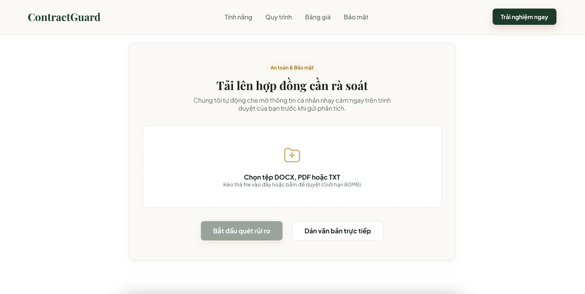

*Hình 2: Màn hình tải hợp đồng cần rà soát - nhấn mạnh an toàn, bảo mật và hỗ trợ DOCX/PDF/TXT.*

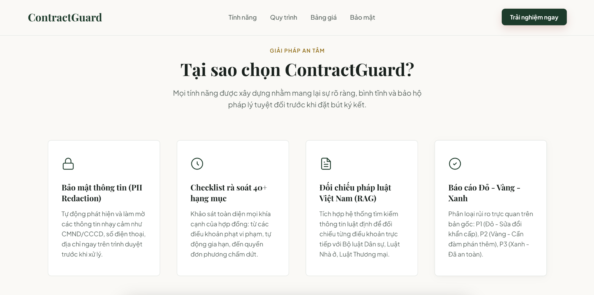

*Hình 3: Cụm tính năng chính - PII Redaction, checklist 40+ hạng mục, RAG pháp luật Việt Nam, báo cáo Đỏ - Vàng - Xanh.*

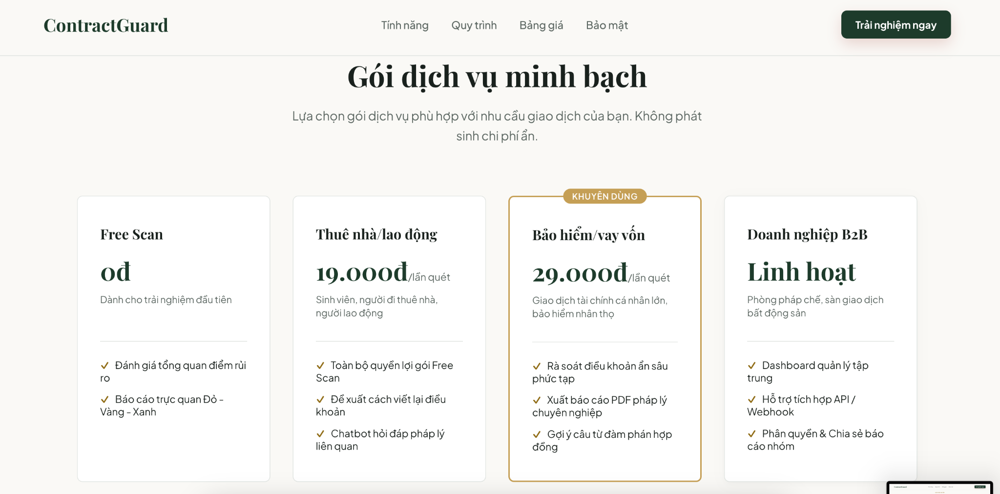

*Hình 4: Bảng giá minh bạch - Free Scan, thuê nhà/lao động, bảo hiểm/vay vốn, B2B.*

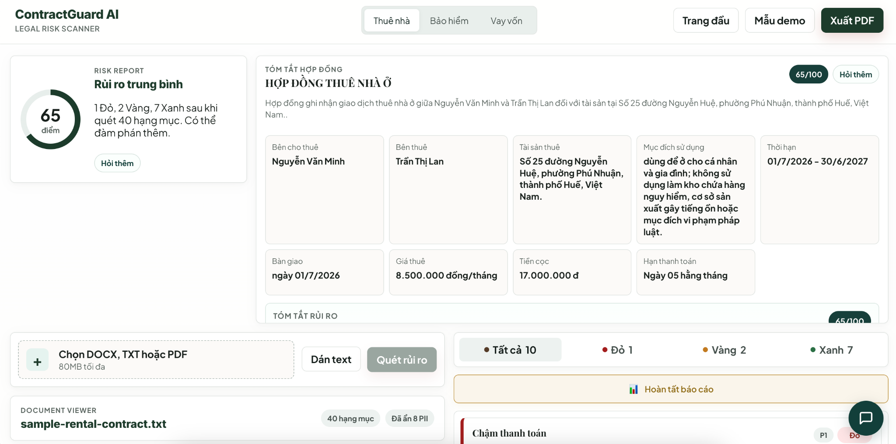

*Hình 5: Màn hình báo cáo sau quét - điểm rủi ro, tóm tắt hợp đồng, các trường quan trọng và danh sách rủi ro.*

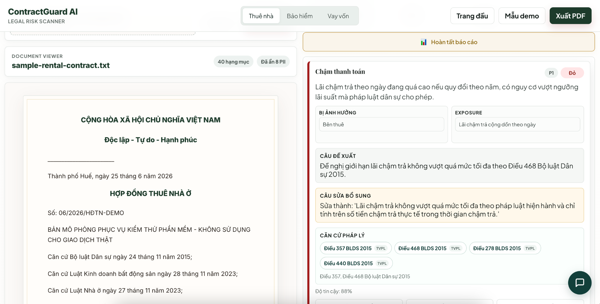

Hình 6: Thẻ hành động - phân tích điều khoản chậm thanh toán, mức thiệt hại ước tính, câu đề xuất sửa và căn cứ pháp lý.

## 7. Demo 60 giây đề xuất cho BGK

<table style="border-collapse: collapse; width: 100%; border: 1px solid #dddddd; margin-bottom: 16px;">
  <tr>
    <th style="border: 1px solid #dddddd; padding: 8px; text-align: left; background-color: #124A38; color: #ffffff"><strong>Mốc thời gian</strong></th>
    <th style="border: 1px solid #dddddd; padding: 8px; text-align: left; background-color: #124A38; color: #ffffff"><strong>Nội dung nói/thao tác</strong></th>
    <th style="border: 1px solid #dddddd; padding: 8px; text-align: left; background-color: #124A38; color: #ffffff"><strong>Điểm cần chứng minh</strong></th>
  </tr>
  <tr>
    <td style="border: 1px solid #dddddd; padding: 8px; text-align: left">0-10s</td>
    <td style="border: 1px solid #dddddd; padding: 8px; text-align: left">Mở trang đầu, nói problem statement và nhóm khách hàng.</td>
    <td style="border: 1px solid #dddddd; padding: 8px; text-align: left">Vấn đề rõ, đối tượng rõ.</td>
  </tr>
  <tr>
    <td style="border: 1px solid #dddddd; padding: 8px; text-align: left; background-color: #FAFAFA">10-20s</td>
    <td style="border: 1px solid #dddddd; padding: 8px; text-align: left; background-color: #FAFAFA">Tải hợp đồng demo có cài bẫy hoặc chạy mẫu demo.</td>
    <td style="border: 1px solid #dddddd; padding: 8px; text-align: left; background-color: #FAFAFA">Zero-Prompt, người dùng không phải viết prompt.</td>
  </tr>
  <tr>
    <td style="border: 1px solid #dddddd; padding: 8px; text-align: left">20-35s</td>
    <td style="border: 1px solid #dddddd; padding: 8px; text-align: left">Hiển thị quy trình OCR -&gt; PII -&gt; RAG -&gt; Map.</td>
    <td style="border: 1px solid #dddddd; padding: 8px; text-align: left">AI là lõi xử lý, có bảo mật.</td>
  </tr>
  <tr>
    <td style="border: 1px solid #dddddd; padding: 8px; text-align: left; background-color: #FAFAFA">35-50s</td>
    <td style="border: 1px solid #dddddd; padding: 8px; text-align: left; background-color: #FAFAFA">Mở báo cáo rủi ro, chỉ vào đoạn highlight.</td>
    <td style="border: 1px solid #dddddd; padding: 8px; text-align: left; background-color: #FAFAFA">Visible AI, rủi ro nằm ở đâu thấy ngay.</td>
  </tr>
  <tr>
    <td style="border: 1px solid #dddddd; padding: 8px; text-align: left">50-60s</td>
    <td style="border: 1px solid #dddddd; padding: 8px; text-align: left">Mở thẻ hành động, copy câu sửa và xuất PDF.</td>
    <td style="border: 1px solid #dddddd; padding: 8px; text-align: left">Actionable Advice, có giá trị sử dụng ngay.</td>
  </tr>
</table>

## 8. Action Card mẫu

Action Card là đầu ra biến phân tích thành hành động. Mỗi thẻ gồm mức rủi ro, điều khoản gốc, giải thích đời thường, hậu quả có thể xảy ra, câu đề xuất sửa và hành động ưu tiên. Ví dụ dưới đây minh họa cách hệ thống xử lý điều khoản hoàn trả tiền đặt cọc chưa rõ thời hạn và căn cứ khấu trừ.

<table style="border-collapse: collapse; width: 100%; border: 1px solid #dddddd; margin-bottom: 16px;">
  <tr>
    <th style="border: 1px solid #dddddd; padding: 8px; text-align: left; background-color: #124A38; color: #ffffff"><strong>Trường thông tin</strong></th>
    <th style="border: 1px solid #dddddd; padding: 8px; text-align: left; background-color: #124A38; color: #ffffff"><strong>Ví dụ hiển thị trong demo</strong></th>
  </tr>
  <tr>
    <td style="border: 1px solid #dddddd; padding: 8px; text-align: left">Mức rủi ro</td>
    <td style="border: 1px solid #dddddd; padding: 8px; text-align: left">🟡 Vàng - Điều khoản cần làm rõ</td>
  </tr>
  <tr>
    <td style="border: 1px solid #dddddd; padding: 8px; text-align: left">Điều khoản gốc</td>
    <td style="border: 1px solid #dddddd; padding: 8px; text-align: left">“Tiền đặt cọc được hoàn trả khi kết thúc hợp đồng sau khi trừ các khoản còn phải thanh toán hoặc bồi thường nếu có.”</td>
  </tr>
  <tr>
    <td style="border: 1px solid #dddddd; padding: 8px; text-align: left">Giải thích đời thường</td>
    <td style="border: 1px solid #dddddd; padding: 8px; text-align: left">Điều khoản chưa nêu rõ thời hạn hoàn cọc và cách xác định khoản bồi thường. Nếu không làm rõ, người thuê có thể bị kéo dài thời gian nhận lại cọc hoặc bị trừ cọc thiếu căn cứ.</td>
  </tr>
  <tr>
    <td style="border: 1px solid #dddddd; padding: 8px; text-align: left">Gợi ý sửa</td>
    <td style="border: 1px solid #dddddd; padding: 8px; text-align: left">“Bên cho thuê hoàn trả tiền đặt cọc trong vòng 05 ngày làm việc kể từ ngày nhận lại nhà, sau khi hai bên ký biên bản bàn giao và thống nhất bằng văn bản các khoản khấu trừ nếu có.”</td>
  </tr>
  <tr>
    <td style="border: 1px solid #dddddd; padding: 8px; text-align: left">Hành động đề xuất</td>
    <td style="border: 1px solid #dddddd; padding: 8px; text-align: left">Yêu cầu bổ sung thời hạn hoàn cọc, mẫu biên bản bàn giao và cơ chế xác nhận chi phí khấu trừ.</td>
  </tr>
</table>

## 9. Chỉ số kiểm thử chất lượng MVP

Nhóm sử dụng các chỉ số dưới đây để chuyển việc đánh giá prototype từ cảm tính sang có thể đo lường. Đây là mục tiêu kiểm thử nội bộ ban đầu và sẽ được cập nhật khi có thêm dữ liệu người dùng.

<table style="border-collapse: collapse; width: 100%; border: 1px solid #dddddd; margin-bottom: 16px;">
  <tr>
    <th style="border: 1px solid #dddddd; padding: 8px; text-align: left; background-color: #124A38; color: #ffffff"><strong>Chỉ số</strong></th>
    <th style="border: 1px solid #dddddd; padding: 8px; text-align: left; background-color: #124A38; color: #ffffff"><strong>Cách đo</strong></th>
    <th style="border: 1px solid #dddddd; padding: 8px; text-align: left; background-color: #124A38; color: #ffffff"><strong>Mục tiêu MVP</strong></th>
  </tr>
  <tr>
    <td style="border: 1px solid #dddddd; padding: 8px; text-align: left">Coverage Rate</td>
    <td style="border: 1px solid #dddddd; padding: 8px; text-align: left">Số lỗi/rủi ro cố tình cài trong hợp đồng test được AI phát hiện.</td>
    <td style="border: 1px solid #dddddd; padding: 8px; text-align: left">Tối thiểu 85% trong bộ test nội bộ.</td>
  </tr>
  <tr>
    <td style="border: 1px solid #dddddd; padding: 8px; text-align: left">Highlight Accuracy</td>
    <td style="border: 1px solid #dddddd; padding: 8px; text-align: left">Độ khớp giữa thẻ rủi ro và đoạn văn bản gốc được bôi màu.</td>
    <td style="border: 1px solid #dddddd; padding: 8px; text-align: left">Không lệch đoạn; không bôi thừa/thiếu nội dung quan trọng.</td>
  </tr>
  <tr>
    <td style="border: 1px solid #dddddd; padding: 8px; text-align: left">Readability</td>
    <td style="border: 1px solid #dddddd; padding: 8px; text-align: left">Mức dễ hiểu của giải thích đối với người không học luật.</td>
    <td style="border: 1px solid #dddddd; padding: 8px; text-align: left">Mỗi thẻ dùng ngôn ngữ đời thường và nêu hậu quả cụ thể.</td>
  </tr>
  <tr>
    <td style="border: 1px solid #dddddd; padding: 8px; text-align: left">Privacy Check</td>
    <td style="border: 1px solid #dddddd; padding: 8px; text-align: left">Khả năng che CCCD, số điện thoại, địa chỉ, tài khoản trước khi xử lý.</td>
    <td style="border: 1px solid #dddddd; padding: 8px; text-align: left">Che đúng dữ liệu nhạy cảm trong hợp đồng mẫu.</td>
  </tr>
  <tr>
    <td style="border: 1px solid #dddddd; padding: 8px; text-align: left">Demo Time</td>
    <td style="border: 1px solid #dddddd; padding: 8px; text-align: left">Thời gian để người ngoài hiểu sản phẩm.</td>
    <td style="border: 1px solid #dddddd; padding: 8px; text-align: left">Dưới 60 giây theo yêu cầu demo concept.</td>
  </tr>
</table>

# PHẦN V: MÔ HÌNH KINH DOANH, TÀI CHÍNH VÀ SCALABILITY

## 1. Mô hình doanh thu

<table style="border-collapse: collapse; width: 100%; border: 1px solid #dddddd; margin-bottom: 16px;">
  <tr>
    <th style="border: 1px solid #dddddd; padding: 8px; text-align: left; background-color: #124A38; color: #ffffff"><strong>Gói</strong></th>
    <th style="border: 1px solid #dddddd; padding: 8px; text-align: left; background-color: #124A38; color: #ffffff"><strong>Khách hàng</strong></th>
    <th style="border: 1px solid #dddddd; padding: 8px; text-align: left; background-color: #124A38; color: #ffffff"><strong>Giá dự kiến</strong></th>
    <th style="border: 1px solid #dddddd; padding: 8px; text-align: left; background-color: #124A38; color: #ffffff"><strong>Giá trị nhận được</strong></th>
  </tr>
  <tr>
    <td style="border: 1px solid #dddddd; padding: 8px; text-align: left">Free Scan</td>
    <td style="border: 1px solid #dddddd; padding: 8px; text-align: left">Người dùng mới</td>
    <td style="border: 1px solid #dddddd; padding: 8px; text-align: left">0đ</td>
    <td style="border: 1px solid #dddddd; padding: 8px; text-align: left">Quét nhanh 1 trang/điều khoản đầu, xem mẫu cảnh báo.</td>
  </tr>
  <tr>
    <td style="border: 1px solid #dddddd; padding: 8px; text-align: left; background-color: #FAFAFA">Thuê nhà/lao động</td>
    <td style="border: 1px solid #dddddd; padding: 8px; text-align: left; background-color: #FAFAFA">Sinh viên, người thuê nhà, người lao động</td>
    <td style="border: 1px solid #dddddd; padding: 8px; text-align: left; background-color: #FAFAFA">19.000đ/lần</td>
    <td style="border: 1px solid #dddddd; padding: 8px; text-align: left; background-color: #FAFAFA">Báo cáo rủi ro, highlight, câu sửa.</td>
  </tr>
  <tr>
    <td style="border: 1px solid #dddddd; padding: 8px; text-align: left">Bảo hiểm/vay vốn/kỳ nghỉ</td>
    <td style="border: 1px solid #dddddd; padding: 8px; text-align: left">Người lớn tuổi, hợp đồng giá trị lớn</td>
    <td style="border: 1px solid #dddddd; padding: 8px; text-align: left">29.000đ/lần bản cơ bản; 99.000-199.000đ bản sâu sau kiểm chứng</td>
    <td style="border: 1px solid #dddddd; padding: 8px; text-align: left">Ưu tiên rủi ro tài chính, phí ẩn, chấm dứt, hoàn tiền.</td>
  </tr>
  <tr>
    <td style="border: 1px solid #dddddd; padding: 8px; text-align: left; background-color: #FAFAFA">B2B Dashboard</td>
    <td style="border: 1px solid #dddddd; padding: 8px; text-align: left; background-color: #FAFAFA">Phòng pháp chế/doanh nghiệp</td>
    <td style="border: 1px solid #dddddd; padding: 8px; text-align: left; background-color: #FAFAFA">Theo số người dùng/hợp đồng</td>
    <td style="border: 1px solid #dddddd; padding: 8px; text-align: left; background-color: #FAFAFA">Rà soát hàng loạt, dashboard rủi ro, workflow duyệt nội bộ.</td>
  </tr>
</table>

## 2. Phạm vi thị trường thử nghiệm

Nhóm xác định phạm vi triển khai ban đầu ở quy mô nhỏ trên toàn quốc, chủ yếu thông qua nền tảng trực tuyến và các cộng đồng có thể tiếp cận trực tiếp. Số liệu khảo sát 167 người được dùng để lựa chọn nhóm khách hàng và tính năng, nhưng không được xem là mẫu đại diện thống kê cho toàn quốc.

<table style="border-collapse: collapse; width: 100%; border: 1px solid #dddddd; margin-bottom: 16px;">
  <tr>
    <th style="border: 1px solid #dddddd; padding: 8px; text-align: left; background-color: #124A38; color: #ffffff"><strong>Phạm vi</strong></th>
    <th style="border: 1px solid #dddddd; padding: 8px; text-align: left; background-color: #124A38; color: #ffffff"><strong>Cách xác định</strong></th>
    <th style="border: 1px solid #dddddd; padding: 8px; text-align: left; background-color: #124A38; color: #ffffff"><strong>Quy mô phù hợp</strong></th>
    <th style="border: 1px solid #dddddd; padding: 8px; text-align: left; background-color: #124A38; color: #ffffff"><strong>Mục đích</strong></th>
  </tr>
  <tr>
    <td style="border: 1px solid #dddddd; padding: 8px; text-align: left">Dữ liệu kiểm chứng ban đầu</td>
    <td style="border: 1px solid #dddddd; padding: 8px; text-align: left">Khảo sát 167 người và 02 phỏng vấn sâu.</td>
    <td style="border: 1px solid #dddddd; padding: 8px; text-align: left">Mẫu thuận tiện do nhóm tự thực hiện; không đại diện cho toàn bộ thị trường.</td>
    <td style="border: 1px solid #dddddd; padding: 8px; text-align: left">Xác định nỗi đau, mức giá tham khảo và tính năng MVP.</td>
  </tr>
  <tr>
    <td style="border: 1px solid #dddddd; padding: 8px; text-align: left; background-color: #FAFAFA">Nhóm có thể tiếp cận trong 12 tháng</td>
    <td style="border: 1px solid #dddddd; padding: 8px; text-align: left; background-color: #FAFAFA">Trường học, nhóm người thuê nhà và cộng đồng trực tuyến trên toàn quốc.</td>
    <td style="border: 1px solid #dddddd; padding: 8px; text-align: left; background-color: #FAFAFA">Khoảng 500-1.000 người được tiếp cận trực tiếp qua 5-10 kênh nhỏ.</td>
    <td style="border: 1px solid #dddddd; padding: 8px; text-align: left; background-color: #FAFAFA">Kiểm tra tỷ lệ sử dụng thật và khả năng trả phí.</td>
  </tr>
  <tr>
    <td style="border: 1px solid #dddddd; padding: 8px; text-align: left">Mục tiêu thử nghiệm</td>
    <td style="border: 1px solid #dddddd; padding: 8px; text-align: left">Bình quân 25-50 lượt trả phí/tháng sau giai đoạn thử nghiệm.</td>
    <td style="border: 1px solid #dddddd; padding: 8px; text-align: left">Khoảng 300-600 lượt trả phí/năm; doanh thu B2C 8,7-17,4 triệu đồng.</td>
    <td style="border: 1px solid #dddddd; padding: 8px; text-align: left">Đủ để đánh giá tính khả thi trước khi quyết định phát triển tiếp.</td>
  </tr>
</table>

## 3. Chi phí trên mỗi lượt và điểm cân bằng quy mô nhỏ

<table style="border-collapse: collapse; width: 100%; border: 1px solid #dddddd; margin-bottom: 16px;">
  <tr>
    <th style="border: 1px solid #dddddd; padding: 8px; text-align: left; background-color: #124A38; color: #ffffff"><strong>Chỉ số</strong></th>
    <th style="border: 1px solid #dddddd; padding: 8px; text-align: left; background-color: #124A38; color: #ffffff"><strong>Cách tính</strong></th>
    <th style="border: 1px solid #dddddd; padding: 8px; text-align: left; background-color: #124A38; color: #ffffff"><strong>Mức sử dụng trong thử nghiệm</strong></th>
  </tr>
  <tr>
    <td style="border: 1px solid #dddddd; padding: 8px; text-align: left">Giá B2C tham khảo</td>
    <td style="border: 1px solid #dddddd; padding: 8px; text-align: left">Chọn mức thấp trong khoảng giá khảo sát.</td>
    <td style="border: 1px solid #dddddd; padding: 8px; text-align: left">29.000đ/lượt trả phí.</td>
  </tr>
  <tr>
    <td style="border: 1px solid #dddddd; padding: 8px; text-align: left; background-color: #FAFAFA">Chi phí AI/OCR</td>
    <td style="border: 1px solid #dddddd; padding: 8px; text-align: left; background-color: #FAFAFA">Theo dõi theo số trang và lượng xử lý thực tế.</td>
    <td style="border: 1px solid #dddddd; padding: 8px; text-align: left; background-color: #FAFAFA">Tối đa 1.500đ/lượt.</td>
  </tr>
  <tr>
    <td style="border: 1px solid #dddddd; padding: 8px; text-align: left">Phí thanh toán</td>
    <td style="border: 1px solid #dddddd; padding: 8px; text-align: left">29.000đ x 3%.</td>
    <td style="border: 1px solid #dddddd; padding: 8px; text-align: left">Khoảng 870đ/lượt.</td>
  </tr>
  <tr>
    <td style="border: 1px solid #dddddd; padding: 8px; text-align: left; background-color: #FAFAFA">Phần còn lại sau chi phí biến đổi</td>
    <td style="border: 1px solid #dddddd; padding: 8px; text-align: left; background-color: #FAFAFA">29.000 - 1.500 - 870.</td>
    <td style="border: 1px solid #dddddd; padding: 8px; text-align: left; background-color: #FAFAFA">Khoảng 26.630đ/lượt, trước chi phí vận hành chung.</td>
  </tr>
  <tr>
    <td style="border: 1px solid #dddddd; padding: 8px; text-align: left">Chi phí vận hành cơ bản</td>
    <td style="border: 1px solid #dddddd; padding: 8px; text-align: left">Hosting, tên miền và công cụ dùng chung.</td>
    <td style="border: 1px solid #dddddd; padding: 8px; text-align: left">Khoảng 1.500.000đ/tháng; nhóm chưa tính lương thành viên.</td>
  </tr>
  <tr>
    <td style="border: 1px solid #dddddd; padding: 8px; text-align: left; background-color: #FAFAFA">Điểm cân bằng tham khảo</td>
    <td style="border: 1px solid #dddddd; padding: 8px; text-align: left; background-color: #FAFAFA">1.500.000 / 26.630.</td>
    <td style="border: 1px solid #dddddd; padding: 8px; text-align: left; background-color: #FAFAFA">Khoảng 57 lượt trả phí/tháng; chỉ dùng để theo dõi thử nghiệm.</td>
  </tr>
</table>

## 4. Kịch bản thu - chi 12 tháng ở quy mô thử nghiệm

<table style="border-collapse: collapse; width: 100%; border: 1px solid #dddddd; margin-bottom: 16px;">
  <tr>
    <th style="border: 1px solid #dddddd; padding: 8px; text-align: left; background-color: #124A38; color: #ffffff"><strong>Giai đoạn</strong></th>
    <th style="border: 1px solid #dddddd; padding: 8px; text-align: left; background-color: #124A38; color: #ffffff"><strong>Sản lượng dự kiến</strong></th>
    <th style="border: 1px solid #dddddd; padding: 8px; text-align: left; background-color: #124A38; color: #ffffff"><strong>Doanh thu tham khảo</strong></th>
  </tr>
  <tr>
    <td style="border: 1px solid #dddddd; padding: 8px; text-align: left">Tháng 1-3</td>
    <td style="border: 1px solid #dddddd; padding: 8px; text-align: left">20 lượt trả phí/tháng x 29.000đ x 3 tháng.</td>
    <td style="border: 1px solid #dddddd; padding: 8px; text-align: left">Khoảng 1,74 triệu đồng; ưu tiên thu phản hồi và sửa lỗi.</td>
  </tr>
  <tr>
    <td style="border: 1px solid #dddddd; padding: 8px; text-align: left; background-color: #FAFAFA">Tháng 4-6</td>
    <td style="border: 1px solid #dddddd; padding: 8px; text-align: left; background-color: #FAFAFA">40 lượt trả phí/tháng x 29.000đ x 3 tháng.</td>
    <td style="border: 1px solid #dddddd; padding: 8px; text-align: left; background-color: #FAFAFA">Khoảng 3,48 triệu đồng.</td>
  </tr>
  <tr>
    <td style="border: 1px solid #dddddd; padding: 8px; text-align: left">Tháng 7-12</td>
    <td style="border: 1px solid #dddddd; padding: 8px; text-align: left">60 lượt trả phí/tháng x 29.000đ x 6 tháng.</td>
    <td style="border: 1px solid #dddddd; padding: 8px; text-align: left">Khoảng 10,44 triệu đồng; chỉ tăng khi hệ thống ổn định.</td>
  </tr>
  <tr>
    <td style="border: 1px solid #dddddd; padding: 8px; text-align: left; background-color: #FAFAFA">Một thử nghiệm B2B nhỏ</td>
    <td style="border: 1px solid #dddddd; padding: 8px; text-align: left; background-color: #FAFAFA">01 đơn vị x 1.000.000đ/tháng x 3 tháng, nếu đơn vị chấp nhận trả phí.</td>
    <td style="border: 1px solid #dddddd; padding: 8px; text-align: left; background-color: #FAFAFA">Tối đa 3 triệu đồng; không ghi nhận nếu chưa có giao dịch.</td>
  </tr>
  <tr>
    <td style="border: 1px solid #dddddd; padding: 8px; text-align: left">Tổng kịch bản năm đầu</td>
    <td style="border: 1px solid #dddddd; padding: 8px; text-align: left">B2C và một thử nghiệm B2B nhỏ.</td>
    <td style="border: 1px solid #dddddd; padding: 8px; text-align: left">Khoảng 18,66 triệu đồng; đây là mức thử nghiệm, không phải cam kết doanh thu.</td>
  </tr>
</table>

## 5. Chỉ số cần theo dõi trong giai đoạn thử nghiệm

Ở giai đoạn đầu, nhóm chỉ theo dõi một số chỉ số đơn giản để biết người dùng có sử dụng và sẵn sàng trả phí hay không. Các chỉ số này là mục tiêu làm việc, chưa phải kết quả kinh doanh thực tế.

<table style="border-collapse: collapse; width: 100%; border: 1px solid #dddddd; margin-bottom: 16px;">
  <tr>
    <th style="border: 1px solid #dddddd; padding: 8px; text-align: left; background-color: #124A38; color: #ffffff"><strong>Chỉ số</strong></th>
    <th style="border: 1px solid #dddddd; padding: 8px; text-align: left; background-color: #124A38; color: #ffffff"><strong>Mức theo dõi</strong></th>
    <th style="border: 1px solid #dddddd; padding: 8px; text-align: left; background-color: #124A38; color: #ffffff"><strong>Dữ liệu cần lưu</strong></th>
  </tr>
  <tr>
    <td style="border: 1px solid #dddddd; padding: 8px; text-align: left">Chi phí tìm một người trả phí</td>
    <td style="border: 1px solid #dddddd; padding: 8px; text-align: left">Mục tiêu không quá 10.000đ/người trong thử nghiệm.</td>
    <td style="border: 1px solid #dddddd; padding: 8px; text-align: left">Chi phí từng kênh và số giao dịch thực tế.</td>
  </tr>
  <tr>
    <td style="border: 1px solid #dddddd; padding: 8px; text-align: left">Tỷ lệ chuyển sang trả phí</td>
    <td style="border: 1px solid #dddddd; padding: 8px; text-align: left">Mục tiêu ban đầu 10-15% số người hoàn tất bản quét miễn phí.</td>
    <td style="border: 1px solid #dddddd; padding: 8px; text-align: left">Lượt quét miễn phí, lượt mở báo cáo và giao dịch.</td>
  </tr>
  <tr>
    <td style="border: 1px solid #dddddd; padding: 8px; text-align: left">Mức sử dụng lại</td>
    <td style="border: 1px solid #dddddd; padding: 8px; text-align: left">Chưa đặt mục tiêu cứng; theo dõi trong 3-6 tháng.</td>
    <td style="border: 1px solid #dddddd; padding: 8px; text-align: left">Số người quay lại và loại hợp đồng được quét lần sau.</td>
  </tr>
  <tr>
    <td style="border: 1px solid #dddddd; padding: 8px; text-align: left">Chi phí AI/OCR</td>
    <td style="border: 1px solid #dddddd; padding: 8px; text-align: left">Không quá 1.500đ/lượt.</td>
    <td style="border: 1px solid #dddddd; padding: 8px; text-align: left">Số trang, lượng xử lý và chi phí từng lượt.</td>
  </tr>
  <tr>
    <td style="border: 1px solid #dddddd; padding: 8px; text-align: left">Chi phí vận hành</td>
    <td style="border: 1px solid #dddddd; padding: 8px; text-align: left">Giữ trong khoảng 1,5 triệu đồng/tháng khi chưa có doanh thu ổn định.</td>
    <td style="border: 1px solid #dddddd; padding: 8px; text-align: left">Hóa đơn hosting, tên miền và công cụ.</td>
  </tr>
</table>

## 6. Khả năng mở rộng có kiểm soát

Trong 6-12 tháng đầu, nhóm chỉ tập trung hoàn thiện hợp đồng thuê nhà và kiểm tra nhu cầu người dùng trên toàn quốc qua nền tảng trực tuyến. Việc bổ sung hợp đồng bảo hiểm, vay vốn hoặc tính năng B2B chỉ được thực hiện sau khi có dữ liệu sử dụng ổn định và phản hồi cho thấy sản phẩm thực sự giúp tiết kiệm thời gian.

## 7. Thử nghiệm B2B quy mô nhỏ trên toàn quốc

Nhóm dự kiến thử nghiệm với một đơn vị nhỏ có nhu cầu rà soát hợp đồng lặp lại. Mục tiêu là kiểm tra quy trình và mức tiết kiệm thời gian, chưa đặt mục tiêu bán cho ngân hàng, công ty bảo hiểm hoặc triển khai diện rộng.

<table style="border-collapse: collapse; width: 100%; border: 1px solid #dddddd; margin-bottom: 16px;">
  <tr>
    <th style="border: 1px solid #dddddd; padding: 8px; text-align: left; background-color: #124A38; color: #ffffff"><strong>Hạng mục</strong></th>
    <th style="border: 1px solid #dddddd; padding: 8px; text-align: left; background-color: #124A38; color: #ffffff"><strong>Phạm vi thử nghiệm</strong></th>
    <th style="border: 1px solid #dddddd; padding: 8px; text-align: left; background-color: #124A38; color: #ffffff"><strong>Cách đánh giá</strong></th>
  </tr>
  <tr>
    <td style="border: 1px solid #dddddd; padding: 8px; text-align: left">Đối tác thử nghiệm</td>
    <td style="border: 1px solid #dddddd; padding: 8px; text-align: left">01 doanh nghiệp nhỏ, đơn vị bất động sản hoặc bộ phận hành chính phù hợp trên toàn quốc.</td>
    <td style="border: 1px solid #dddddd; padding: 8px; text-align: left">Có người phụ trách và văn bản đồng ý sử dụng dữ liệu đã ẩn danh.</td>
  </tr>
  <tr>
    <td style="border: 1px solid #dddddd; padding: 8px; text-align: left">Số lượng hợp đồng</td>
    <td style="border: 1px solid #dddddd; padding: 8px; text-align: left">Khoảng 30-50 hợp đồng trong 30 ngày.</td>
    <td style="border: 1px solid #dddddd; padding: 8px; text-align: left">Đủ để ghi nhận lỗi lặp lại nhưng vẫn phù hợp năng lực nhóm.</td>
  </tr>
  <tr>
    <td style="border: 1px solid #dddddd; padding: 8px; text-align: left">Chi phí thử nghiệm</td>
    <td style="border: 1px solid #dddddd; padding: 8px; text-align: left">Miễn phí hoặc tối đa 1.000.000đ/tháng nếu đối tác chấp nhận.</td>
    <td style="border: 1px solid #dddddd; padding: 8px; text-align: left">Không coi là doanh thu chắc chắn khi chưa phát sinh thanh toán.</td>
  </tr>
  <tr>
    <td style="border: 1px solid #dddddd; padding: 8px; text-align: left">Hiệu quả thời gian</td>
    <td style="border: 1px solid #dddddd; padding: 8px; text-align: left">So sánh thời gian rà soát thủ công với thời gian có AI.</td>
    <td style="border: 1px solid #dddddd; padding: 8px; text-align: left">Mục tiêu giảm tối thiểu 20% thời gian rà soát bước đầu.</td>
  </tr>
  <tr>
    <td style="border: 1px solid #dddddd; padding: 8px; text-align: left">Chất lượng và dữ liệu</td>
    <td style="border: 1px solid #dddddd; padding: 8px; text-align: left">Phát hiện ít nhất 85% lỗi trong bộ hợp đồng kiểm thử; ẩn đúng dữ liệu cá nhân.</td>
    <td style="border: 1px solid #dddddd; padding: 8px; text-align: left">Dừng thử nghiệm nếu có lỗi dữ liệu nghiêm trọng hoặc bỏ sót rủi ro quan trọng.</td>
  </tr>
  <tr>
    <td style="border: 1px solid #dddddd; padding: 8px; text-align: left">Đầu ra</td>
    <td style="border: 1px solid #dddddd; padding: 8px; text-align: left">Bảng lỗi, log xử lý và phiếu nhận xét của đơn vị thử nghiệm.</td>
    <td style="border: 1px solid #dddddd; padding: 8px; text-align: left">Chỉ đề xuất phát triển B2B khi kết quả thực tế tích cực.</td>
  </tr>
</table>

## 8. Kế hoạch thử nghiệm 30 ngày

<table style="border-collapse: collapse; width: 100%; border: 1px solid #dddddd; margin-bottom: 16px;">
  <tr>
    <th style="border: 1px solid #dddddd; padding: 8px; text-align: left; background-color: #124A38; color: #ffffff"><strong>Nhánh</strong></th>
    <th style="border: 1px solid #dddddd; padding: 8px; text-align: left; background-color: #124A38; color: #ffffff"><strong>Cách triển khai</strong></th>
    <th style="border: 1px solid #dddddd; padding: 8px; text-align: left; background-color: #124A38; color: #ffffff"><strong>Mức hoàn thành phù hợp</strong></th>
    <th style="border: 1px solid #dddddd; padding: 8px; text-align: left; background-color: #124A38; color: #ffffff"><strong>Minh chứng cần lưu</strong></th>
  </tr>
  <tr>
    <td style="border: 1px solid #dddddd; padding: 8px; text-align: left">B2C</td>
    <td style="border: 1px solid #dddddd; padding: 8px; text-align: left">Mời 50-100 người trong nhóm khảo sát và các cộng đồng trực tuyến trên toàn quốc dùng prototype.</td>
    <td style="border: 1px solid #dddddd; padding: 8px; text-align: left">Ít nhất 30 lượt quét hoàn tất, 10 giao dịch thật và phản hồi dễ hiểu từ đa số người dùng.</td>
    <td style="border: 1px solid #dddddd; padding: 8px; text-align: left">Log hệ thống, giao dịch và phiếu phản hồi sau khi quét.</td>
  </tr>
  <tr>
    <td style="border: 1px solid #dddddd; padding: 8px; text-align: left">B2B nhỏ</td>
    <td style="border: 1px solid #dddddd; padding: 8px; text-align: left">01 đơn vị cung cấp 30-50 hợp đồng đã ẩn danh.</td>
    <td style="border: 1px solid #dddddd; padding: 8px; text-align: left">Giảm ít nhất 20% thời gian; phát hiện ≥85% lỗi trong bộ kiểm thử.</td>
    <td style="border: 1px solid #dddddd; padding: 8px; text-align: left">Biên bản giao nhận dữ liệu, bảng so sánh trước/sau và nhận xét của đơn vị.</td>
  </tr>
  <tr>
    <td style="border: 1px solid #dddddd; padding: 8px; text-align: left">Quyết định sau 30 ngày</td>
    <td style="border: 1px solid #dddddd; padding: 8px; text-align: left">Nhóm họp đánh giá chất lượng, chi phí và phản hồi.</td>
    <td style="border: 1px solid #dddddd; padding: 8px; text-align: left">Tiếp tục nếu người dùng thấy hữu ích và chi phí nằm trong giới hạn; nếu không thì thu hẹp hoặc điều chỉnh tính năng.</td>
    <td style="border: 1px solid #dddddd; padding: 8px; text-align: left">Bảng tổng hợp kết quả và quyết định tiếp tục/điều chỉnh/dừng.</td>
  </tr>
</table>

# PHẦN VI: KHẢ NĂNG HỌC HỎI VÀ ĐIỀU CHỈNH

Điểm quan trọng của Vòng 2 không chỉ là có ý tưởng, mà còn phải chứng minh nhóm biết học từ người dùng và điều chỉnh sản phẩm. Sau khảo sát, phỏng vấn và thử nghiệm prototype, nhóm đã thực hiện các điều chỉnh sau:

<table style="border-collapse: collapse; width: 100%; border: 1px solid #dddddd; margin-bottom: 16px;">
  <tr>
    <th style="border: 1px solid #dddddd; padding: 8px; text-align: left; background-color: #124A38; color: #ffffff"><strong>Giả định ban đầu</strong></th>
    <th style="border: 1px solid #dddddd; padding: 8px; text-align: left; background-color: #124A38; color: #ffffff"><strong>Insight / vấn đề phát hiện từ Mom Test</strong></th>
    <th style="border: 1px solid #dddddd; padding: 8px; text-align: left; background-color: #124A38; color: #ffffff"><strong>Điều chỉnh đã thực hiện</strong></th>
  </tr>
  <tr>
    <td style="border: 1px solid #dddddd; padding: 8px; text-align: left">Tập trung chính vào sinh viên thuê nhà.</td>
    <td style="border: 1px solid #dddddd; padding: 8px; text-align: left">Sinh viên là nhóm dễ demo nhưng thiệt hại thường ở mức vài triệu; người lớn tuổi/ít hiểu công nghệ có rủi ro lớn hơn vì liên quan bảo hiểm, tài chính, kỳ nghỉ và tài sản tích lũy.</td>
    <td style="border: 1px solid #dddddd; padding: 8px; text-align: left">Định vị lại: người lớn tuổi/ít hiểu công nghệ là khách hàng ưu tiên mức 1; sinh viên/người thuê nhà là nhóm mở rộng và dùng để MVP dễ kiểm chứng.</td>
  </tr>
  <tr>
    <td style="border: 1px solid #dddddd; padding: 8px; text-align: left; background-color: #FAFAFA">Chỉ cần AI chỉ ra điều khoản rủi ro.</td>
    <td style="border: 1px solid #dddddd; padding: 8px; text-align: left; background-color: #FAFAFA">Người dùng cần biết hậu quả thực tế và thiệt hại bằng tiền: mất cọc 3 triệu, tổng chi phí 4,5 triệu; hoặc viện phí hơn 40 triệu không được bồi thường.</td>
    <td style="border: 1px solid #dddddd; padding: 8px; text-align: left; background-color: #FAFAFA">Bổ sung Exposure, bên bị ảnh hưởng, mức ưu tiên P1/P2/P3 và mô tả hậu quả đời thường trên Action Card.</td>
  </tr>
  <tr>
    <td style="border: 1px solid #dddddd; padding: 8px; text-align: left">Chỉ trả lời dạng báo cáo text.</td>
    <td style="border: 1px solid #dddddd; padding: 8px; text-align: left">Người dùng phổ thông không muốn đọc thêm một văn bản dài; họ cần nhìn thấy chính xác câu nào trong hợp đồng đang gây rủi ro.</td>
    <td style="border: 1px solid #dddddd; padding: 8px; text-align: left">Thiết kế split-view: highlight trực tiếp Đỏ/Vàng/Xanh trên hợp đồng, thẻ hành động ngắn bên cạnh và nút tới đoạn gốc.</td>
  </tr>
  <tr>
    <td style="border: 1px solid #dddddd; padding: 8px; text-align: left; background-color: #FAFAFA">Thu phí ngay theo từng lần quét.</td>
    <td style="border: 1px solid #dddddd; padding: 8px; text-align: left; background-color: #FAFAFA">Người dùng chưa tin công cụ pháp lý mới; sinh viên không thể trả phí cao, còn người lớn tuổi cần thấy lợi ích trước khi nhờ người thân hỗ trợ.</td>
    <td style="border: 1px solid #dddddd; padding: 8px; text-align: left; background-color: #FAFAFA">Chuyển sang Freemium: quét thử miễn phí/trang đầu, sau đó mới thu phí báo cáo sâu hoặc xuất PDF.</td>
  </tr>
  <tr>
    <td style="border: 1px solid #dddddd; padding: 8px; text-align: left">Người dùng sẽ tự xử lý sau khi nhận kết quả.</td>
    <td style="border: 1px solid #dddddd; padding: 8px; text-align: left">Người lớn tuổi thường phải nhờ con cái/người thân khi tranh chấp hoặc khi cần hiểu điều khoản phức tạp.</td>
    <td style="border: 1px solid #dddddd; padding: 8px; text-align: left">Bổ sung tính năng xuất PDF/chia sẻ báo cáo cho người thân hoặc luật sư kiểm tra tiếp.</td>
  </tr>
  <tr>
    <td style="border: 1px solid #dddddd; padding: 8px; text-align: left; background-color: #FAFAFA">Dùng hợp đồng thật thông thường để demo.</td>
    <td style="border: 1px solid #dddddd; padding: 8px; text-align: left; background-color: #FAFAFA">BGK cần thấy AI phát hiện được các bẫy rõ ràng trong thời gian ngắn.</td>
    <td style="border: 1px solid #dddddd; padding: 8px; text-align: left; background-color: #FAFAFA">Xây dựng hợp đồng demo có cài bẫy kiểm thử: lãi chậm trả, hoàn cọc, chấm dứt, phí phát sinh, dữ liệu cá nhân để chứng minh năng lực AI.</td>
  </tr>
</table>

## Giả sử dự án thất bại sau 6 tháng, lý do là gì?

<table style="border-collapse: collapse; width: 100%; border: 1px solid #dddddd; margin-bottom: 16px;">
  <tr>
    <th style="border: 1px solid #dddddd; padding: 8px; text-align: left; background-color: #124A38; color: #ffffff"><strong>Nguyên nhân thất bại có thể xảy ra</strong></th>
    <th style="border: 1px solid #dddddd; padding: 8px; text-align: left; background-color: #124A38; color: #ffffff"><strong>Tín hiệu cảnh báo</strong></th>
    <th style="border: 1px solid #dddddd; padding: 8px; text-align: left; background-color: #124A38; color: #ffffff"><strong>Cách giảm rủi ro</strong></th>
  </tr>
  <tr>
    <td style="border: 1px solid #dddddd; padding: 8px; text-align: left">Người dùng không tin AI pháp lý.</td>
    <td style="border: 1px solid #dddddd; padding: 8px; text-align: left">Tỷ lệ chuyển đổi sau Free Scan thấp.</td>
    <td style="border: 1px solid #dddddd; padding: 8px; text-align: left">Hiển thị căn cứ pháp lý, độ tin cậy, disclaimer và lựa chọn gửi luật sư/người thân.</td>
  </tr>
  <tr>
    <td style="border: 1px solid #dddddd; padding: 8px; text-align: left; background-color: #FAFAFA">Người lớn tuổi khó tự dùng.</td>
    <td style="border: 1px solid #dddddd; padding: 8px; text-align: left; background-color: #FAFAFA">Tỷ lệ bỏ dở ở bước upload cao.</td>
    <td style="border: 1px solid #dddddd; padding: 8px; text-align: left; background-color: #FAFAFA">Mobile-first, nút lớn, hướng dẫn 3 bước, kênh “người thân hỗ trợ”.</td>
  </tr>
  <tr>
    <td style="border: 1px solid #dddddd; padding: 8px; text-align: left">Kết quả AI bỏ sót/nhầm rủi ro.</td>
    <td style="border: 1px solid #dddddd; padding: 8px; text-align: left">Phản hồi lỗi từ người dùng, highlight lệch.</td>
    <td style="border: 1px solid #dddddd; padding: 8px; text-align: left">RAG, bộ test hợp đồng cài bẫy, human review cho lỗi P1, kiểm thử liên tục.</td>
  </tr>
  <tr>
    <td style="border: 1px solid #dddddd; padding: 8px; text-align: left; background-color: #FAFAFA">Chi phí marketing cao hơn doanh thu.</td>
    <td style="border: 1px solid #dddddd; padding: 8px; text-align: left; background-color: #FAFAFA">CAC lớn hơn lãi gộp/LTV.</td>
    <td style="border: 1px solid #dddddd; padding: 8px; text-align: left; background-color: #FAFAFA">Đi qua kênh cộng đồng: trường học, hội người cao tuổi, nhóm thuê nhà, đối tác bảo hiểm/bất động sản.</td>
  </tr>
  <tr>
    <td style="border: 1px solid #dddddd; padding: 8px; text-align: left">Không chứng minh được B2B.</td>
    <td style="border: 1px solid #dddddd; padding: 8px; text-align: left">Doanh nghiệp không dùng pilot.</td>
    <td style="border: 1px solid #dddddd; padding: 8px; text-align: left">Bắt đầu bằng công ty nhỏ/phòng pháp chế ít người, đo thời gian tiết kiệm khi rà soát hợp đồng.</td>
  </tr>
</table>

# PHẦN VII: VẬN HÀNH TEAM, RỦI RO VÀ HƯỚNG PHÁT TRIỂN

## 1. Phân vai đội thi

<table style="border-collapse: collapse; width: 100%; border: 1px solid #dddddd; margin-bottom: 16px;">
  <tr>
    <th style="border: 1px solid #dddddd; padding: 8px; text-align: left; background-color: #124A38; color: #ffffff"><strong>Thành viên</strong></th>
    <th style="border: 1px solid #dddddd; padding: 8px; text-align: left; background-color: #124A38; color: #ffffff"><strong>Vai trò</strong></th>
    <th style="border: 1px solid #dddddd; padding: 8px; text-align: left; background-color: #124A38; color: #ffffff"><strong>Đầu việc chính</strong></th>
    <th style="border: 1px solid #dddddd; padding: 8px; text-align: left; background-color: #124A38; color: #ffffff"><strong>Đầu ra đo lường được</strong></th>
  </tr>
  <tr>
    <td style="border: 1px solid #dddddd; padding: 8px; text-align: left">Quốc Huy (Team Leader)</td>
    <td style="border: 1px solid #dddddd; padding: 8px; text-align: left">Điều phối dự án, tổng hợp báo cáo</td>
    <td style="border: 1px solid #dddddd; padding: 8px; text-align: left">Quản lý tiến độ, chỉnh nội dung, kiểm tra demo, chuẩn hóa câu chuyện thuyết trình.</td>
    <td style="border: 1px solid #dddddd; padding: 8px; text-align: left">Báo cáo hoàn chỉnh, checklist nộp bài, kịch bản demo 60 giây.</td>
  </tr>
  <tr>
    <td style="border: 1px solid #dddddd; padding: 8px; text-align: left; background-color: #FAFAFA">Thanh Lâm</td>
    <td style="border: 1px solid #dddddd; padding: 8px; text-align: left; background-color: #FAFAFA">Nghiên cứu thị trường</td>
    <td style="border: 1px solid #dddddd; padding: 8px; text-align: left; background-color: #FAFAFA">Tìm nguồn số liệu, phân tích khoảng trống ngành, hỗ trợ checklist pháp lý.</td>
    <td style="border: 1px solid #dddddd; padding: 8px; text-align: left; background-color: #FAFAFA">Bảng dữ liệu nguồn, bảng so sánh giải pháp, nội dung thị trường.</td>
  </tr>
  <tr>
    <td style="border: 1px solid #dddddd; padding: 8px; text-align: left">Uyên Minh</td>
    <td style="border: 1px solid #dddddd; padding: 8px; text-align: left">Persona và UX/UI</td>
    <td style="border: 1px solid #dddddd; padding: 8px; text-align: left">Xác định chân dung khách hàng, hành trình người dùng, thiết kế giao diện split-view.</td>
    <td style="border: 1px solid #dddddd; padding: 8px; text-align: left">Persona, wireframe, ảnh prototype.</td>
  </tr>
  <tr>
    <td style="border: 1px solid #dddddd; padding: 8px; text-align: left; background-color: #FAFAFA">Minh Tuấn</td>
    <td style="border: 1px solid #dddddd; padding: 8px; text-align: left; background-color: #FAFAFA">Khảo sát và prompt/backend</td>
    <td style="border: 1px solid #dddddd; padding: 8px; text-align: left; background-color: #FAFAFA">Lập kịch bản Mom Test, quay video, tinh chỉnh prompt phân tích hợp đồng.</td>
    <td style="border: 1px solid #dddddd; padding: 8px; text-align: left; background-color: #FAFAFA">Video phỏng vấn, bộ câu hỏi, prompt nghiệp vụ, test case hợp đồng cài bẫy.</td>
  </tr>
</table>

## 2. Rủi ro sản phẩm và kiểm soát

<table style="border-collapse: collapse; width: 100%; border: 1px solid #dddddd; margin-bottom: 16px;">
  <tr>
    <th style="border: 1px solid #dddddd; padding: 8px; text-align: left; background-color: #124A38; color: #ffffff"><strong>Rủi ro</strong></th>
    <th style="border: 1px solid #dddddd; padding: 8px; text-align: left; background-color: #124A38; color: #ffffff"><strong>Tác động</strong></th>
    <th style="border: 1px solid #dddddd; padding: 8px; text-align: left; background-color: #124A38; color: #ffffff"><strong>Cách kiểm soát</strong></th>
  </tr>
  <tr>
    <td style="border: 1px solid #dddddd; padding: 8px; text-align: left">AI ảo giác hoặc sai pháp lý</td>
    <td style="border: 1px solid #dddddd; padding: 8px; text-align: left">Giảm niềm tin, gây hiểu nhầm.</td>
    <td style="border: 1px solid #dddddd; padding: 8px; text-align: left">RAG, checklist, căn cứ pháp lý, disclaimer không thay thế luật sư.</td>
  </tr>
  <tr>
    <td style="border: 1px solid #dddddd; padding: 8px; text-align: left; background-color: #FAFAFA">OCR đọc sai hợp đồng ảnh mờ</td>
    <td style="border: 1px solid #dddddd; padding: 8px; text-align: left; background-color: #FAFAFA">Highlight sai hoặc bỏ sót.</td>
    <td style="border: 1px solid #dddddd; padding: 8px; text-align: left; background-color: #FAFAFA">Hướng dẫn chụp rõ, crop/xoay, cảnh báo độ tin cậy OCR thấp.</td>
  </tr>
  <tr>
    <td style="border: 1px solid #dddddd; padding: 8px; text-align: left">Rò rỉ dữ liệu cá nhân</td>
    <td style="border: 1px solid #dddddd; padding: 8px; text-align: left">Người dùng ngại upload.</td>
    <td style="border: 1px solid #dddddd; padding: 8px; text-align: left">PII Redaction, mã hóa, xóa file sau xử lý, chính sách dữ liệu minh bạch.</td>
  </tr>
  <tr>
    <td style="border: 1px solid #dddddd; padding: 8px; text-align: left; background-color: #FAFAFA">Cạnh tranh từ AI đại trà</td>
    <td style="border: 1px solid #dddddd; padding: 8px; text-align: left; background-color: #FAFAFA">Người dùng nghĩ ChatGPT đủ.</td>
    <td style="border: 1px solid #dddddd; padding: 8px; text-align: left; background-color: #FAFAFA">Nhấn mạnh Zero-Prompt, highlight, thẻ hành động, checklist Việt Nam.</td>
  </tr>
  <tr>
    <td style="border: 1px solid #dddddd; padding: 8px; text-align: left">Trách nhiệm pháp lý</td>
    <td style="border: 1px solid #dddddd; padding: 8px; text-align: left">Người dùng hiểu nhầm kết quả là tư vấn pháp lý chính thức.</td>
    <td style="border: 1px solid #dddddd; padding: 8px; text-align: left">Luôn ghi “công cụ hỗ trợ tham khảo”, khuyến nghị luật sư với rủi ro Đỏ/P1.</td>
  </tr>
</table>

## 3. Roadmap phát triển

<table style="border-collapse: collapse; width: 100%; border: 1px solid #dddddd; margin-bottom: 16px;">
  <tr>
    <th style="border: 1px solid #dddddd; padding: 8px; text-align: left; background-color: #124A38; color: #ffffff"><strong>Giai đoạn</strong></th>
    <th style="border: 1px solid #dddddd; padding: 8px; text-align: left; background-color: #124A38; color: #ffffff"><strong>Phạm vi trọng tâm</strong></th>
    <th style="border: 1px solid #dddddd; padding: 8px; text-align: left; background-color: #124A38; color: #ffffff"><strong>Nội dung thực hiện</strong></th>
  </tr>
  <tr>
    <td style="border: 1px solid #dddddd; padding: 8px; text-align: left">Giai đoạn 1 - Hoàn thiện MVP</td>
    <td style="border: 1px solid #dddddd; padding: 8px; text-align: left">Người thuê nhà, sinh viên và người mới đi làm trên toàn quốc.</td>
    <td style="border: 1px solid #dddddd; padding: 8px; text-align: left">Ổn định luồng tải hợp đồng, đánh dấu rủi ro và thẻ hành động.</td>
  </tr>
  <tr>
    <td style="border: 1px solid #dddddd; padding: 8px; text-align: left; background-color: #FAFAFA">Giai đoạn 2 - Thử nghiệm người dùng</td>
    <td style="border: 1px solid #dddddd; padding: 8px; text-align: left; background-color: #FAFAFA">50-100 người dùng trong cộng đồng có thể tiếp cận.</td>
    <td style="border: 1px solid #dddddd; padding: 8px; text-align: left; background-color: #FAFAFA">Đo mức dễ dùng, độ chính xác và khả năng trả phí.</td>
  </tr>
  <tr>
    <td style="border: 1px solid #dddddd; padding: 8px; text-align: left">Giai đoạn 3 - Bổ sung có chọn lọc</td>
    <td style="border: 1px solid #dddddd; padding: 8px; text-align: left">Chỉ thêm bảo hiểm hoặc vay vốn khi có đủ phản hồi và dữ liệu kiểm thử.</td>
    <td style="border: 1px solid #dddddd; padding: 8px; text-align: left">Xây dựng checklist riêng cho từng loại hợp đồng.</td>
  </tr>
  <tr>
    <td style="border: 1px solid #dddddd; padding: 8px; text-align: left; background-color: #FAFAFA">Giai đoạn 4 - Pilot B2B nhỏ</td>
    <td style="border: 1px solid #dddddd; padding: 8px; text-align: left; background-color: #FAFAFA">01 đơn vị phù hợp trên toàn quốc, 30-50 hợp đồng.</td>
    <td style="border: 1px solid #dddddd; padding: 8px; text-align: left; background-color: #FAFAFA">Đo thời gian tiết kiệm và chất lượng; chưa triển khai diện rộng.</td>
  </tr>
</table>

## 4. Kết luận

ContractGuard giải quyết một vấn đề thực tế: người dân ký hợp đồng khi chưa hiểu đầy đủ rủi ro. Điểm mạnh của dự án không chỉ nằm ở AI mà ở quy trình chuyên biệt cho hợp đồng: tải tệp không cần viết prompt, ẩn dữ liệu cá nhân, đối chiếu căn cứ pháp lý, đánh dấu trên văn bản gốc và tạo thẻ hành động có câu đề xuất sửa. Dự án đã có dữ liệu khảo sát, kết quả phỏng vấn, mô hình thử nghiệm tài chính và prototype trực tuyến để tiếp tục kiểm chứng ở quy mô nhỏ.

# PHẦN VIII: TÀI LIỆU THAM KHẢO VÀ PHỤ LỤC

## 1. Tài liệu tham khảo

[1] TheNextX_Vong2_HuongDan.docx - Hướng dẫn Vòng 2, thang điểm và yêu cầu video/prototype.

[2] Các tài liệu dự án ContractGuard do nhóm cung cấp: mô tả dự án, prompt nghiệp vụ và tài liệu kiểm thử.

[3] Khảo sát 167 người do đội FACTCHECK AI thực hiện, tháng 7/2026; biểu đồ và phân tích tại Phần III và Phụ lục C.

[4] Bộ Tài chính, Bản tin thị trường bảo hiểm tháng 10/2025: 11.441.220 hợp đồng có hiệu lực. URL: https://www.mof.gov.vn/quan-ly-giam-sat-bao-hiem/ban-tin-thi-truong-bao-hiem-toan-cau/ban-tin-thi-truong-bao-hiem-thang-102025

[5] Bộ Tài chính, Bản tin thị trường bảo hiểm tháng 9/2025: 1.161.502 hợp đồng khai thác mới trong 8 tháng đầu năm 2025. URL: https://vidi.mof.gov.vn/quan-ly-giam-sat-bao-hiem/ban-tin-thi-truong-bao-hiem-toan-cau/ban-tin-thi-truong-bao-hiem-thang-92025

[6] Ủy ban Cạnh tranh Quốc gia - Bộ Công Thương, Mô hình kinh doanh dịch vụ nghỉ dưỡng dài hạn và một số vấn đề phát sinh dưới góc nhìn bảo vệ quyền lợi người tiêu dùng, 30/07/2024. URL: https://moit.gov.vn/tin-tuc/bao-chi-voi-nguoi-dan/mo-hinh-kinh-doanh-dich-vu-nghi-duong-dai-han-so-huu-ky-nghi-va-mot-so-van-de-phat-sinh-duoi-goc-nhin-bao-ve-quyen-loi-n.html

[7] Ủy ban Cạnh tranh Quốc gia - Bộ Công Thương, Báo cáo tổng kết công tác năm 2024: số liệu tổng đài và đơn thư bảo vệ người tiêu dùng, 02/01/2025. URL: https://moit.gov.vn/tin-tuc/hoat-dong/uy-ban-canh-tranh-quoc-gia-to-chuc-hoi-nghi-tong-ket-cong-tac-nam-2024-va-trien-khai-nhiem-vu-nam-2025.html

[8] Bộ Công an, Tiếp nhận khoảng 2.500 đơn tố giác, số tiền chiếm đoạt khoảng 2.600 tỷ đồng liên quan đến lừa đảo hợp đồng kỳ nghỉ, 04/07/2026. URL: https://mps.gov.vn/bai-viet/lua-dao-hop-dong-ky-nghi-tiep-nhan-2-500-don-to-giac-so-tien-chiem-doat-khoang-2-600-ty-dong-1783146602

[9] Video phỏng vấn 1 và 2 do nhóm thực hiện, tháng 7/2026; nội dung được tổng hợp trong phần Mom Test.

[10] Hợp đồng thuê nhà demo cài bẫy ContractGuard, phục vụ kiểm thử phần mềm, không dùng cho giao dịch thật.

[11] Bain &amp; Company, e-Conomy SEA 2025: kinh tế số Đông Nam Á vượt 300 tỷ USD GMV năm 2025. URL: https://www.bain.com/insights/e-conomy-sea-2025/

[12] Cổng Thông tin điện tử Chính phủ, Viet Nam’s digital economy to reach US$36 bln this year, 14/11/2024. URL: https://en.baochinhphu.vn/viet-nams-digital-economy-to-reach-us36-bln-this-year-111241114085659185.htm

[13] Cổng Thông tin điện tử Chính phủ, Digital economy to contribute 30% of GDP by 2030, 12/06/2026. URL: https://en.baochinhphu.vn/digital-economy-to-contribute-30-of-gdp-by-2030-11126061210111086.htm

[14] Mordor Intelligence, Global Legal Tech Market Size &amp; Share Analysis - Growth Trends and Forecast (2026-2031). URL: https://www.mordorintelligence.com/industry-reports/global-legal-tech-market

[15] Mordor Intelligence, RegTech Market Size, Analysis, Report &amp; Growth Drivers 2030. URL: https://www.mordorintelligence.com/industry-reports/global-regtech-industry

## 2. Phụ lục A - Kịch bản phỏng vấn Mom Test

- Lần gần nhất cô/chú/anh/chị ký hợp đồng hoặc giấy cam kết là khi nào?
- Trước khi ký, cô/chú/anh/chị thường đọc kỹ đến mức nào? Phần nào khiến mình khó hiểu?
- Đã từng có lần nào cô/chú/anh/chị thấy mình bị thiệt sau khi ký giấy tờ chưa? Chuyện gì đã xảy ra?
- Khi không hiểu một điều khoản, cô/chú/anh/chị thường hỏi ai hoặc làm gì?
- Nếu hợp đồng có điều khoản có thể khiến mình mất tiền, cô/chú/anh/chị muốn được cảnh báo theo cách nào?
- Cô/chú/anh/chị đã từng trả tiền để nhờ ai kiểm tra giấy tờ/hợp đồng chưa? Vì sao có hoặc chưa?
- Nếu chỉ được thay đổi một điều trong cách đọc hợp đồng hiện nay, cô/chú/anh/chị muốn điều gì dễ hơn?

Lưu ý về sự đồng thuận: trước khi phỏng vấn, người được phỏng vấn xác nhận đồng ý tham gia và đồng ý cho đội sử dụng nội dung phục vụ bài thi.

## 3. Phụ lục B - Minh chứng biểu đồ khảo sát 167 người

Nguồn: Khảo sát do đội FACTCHECK AI tự thực hiện, tháng 7/2026. Các biểu đồ dưới đây là ảnh xuất từ biểu mẫu tổng hợp câu trả lời.

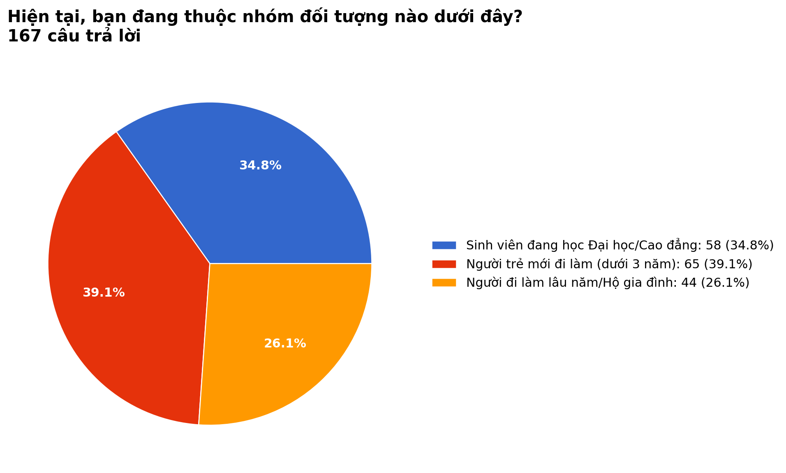

Hình KS1: Biểu đồ khảo sát do nhóm thực hiện (n = 167).

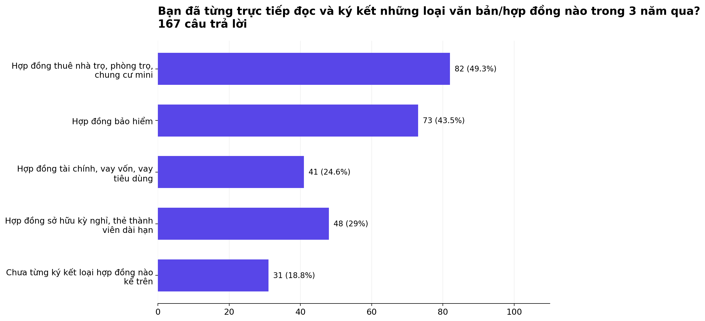

Hình KS2: Biểu đồ khảo sát do nhóm thực hiện (n = 167).

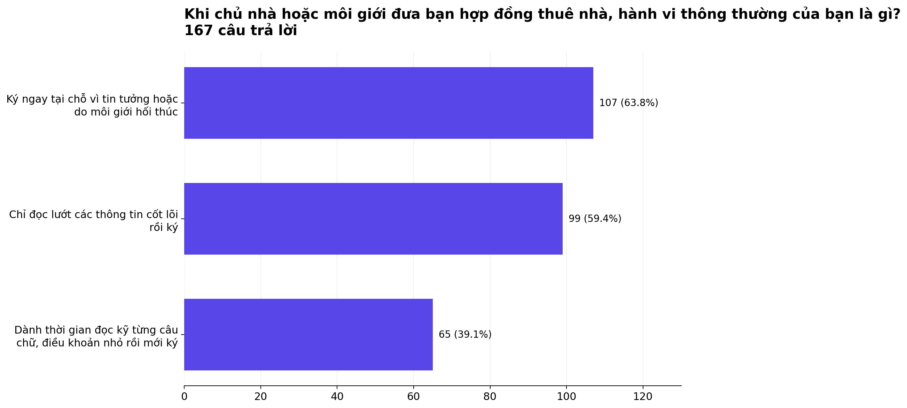

Hình KS3: Biểu đồ khảo sát do nhóm thực hiện (n = 167).

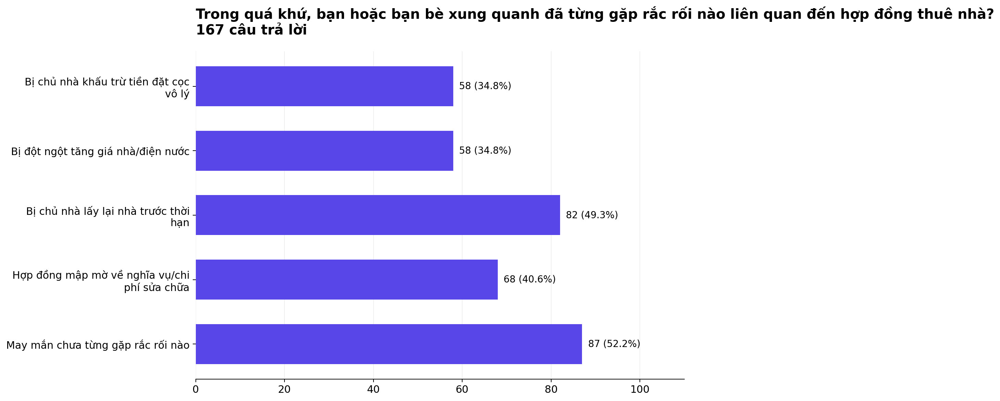

Hình KS4: Biểu đồ khảo sát do nhóm thực hiện (n = 167).

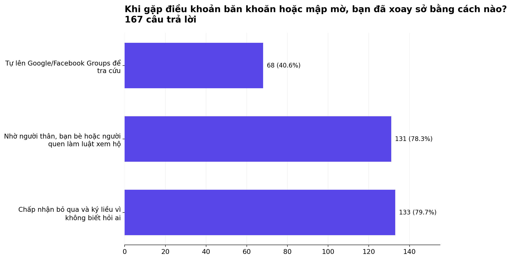

Hình KS5: Biểu đồ khảo sát do nhóm thực hiện (n = 167).

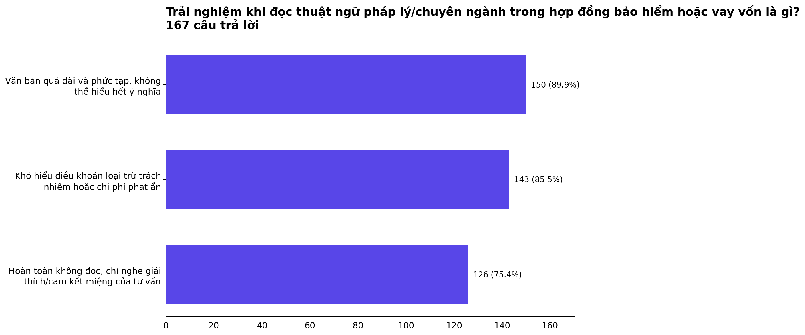

Hình KS6: Biểu đồ khảo sát do nhóm thực hiện (n = 167).

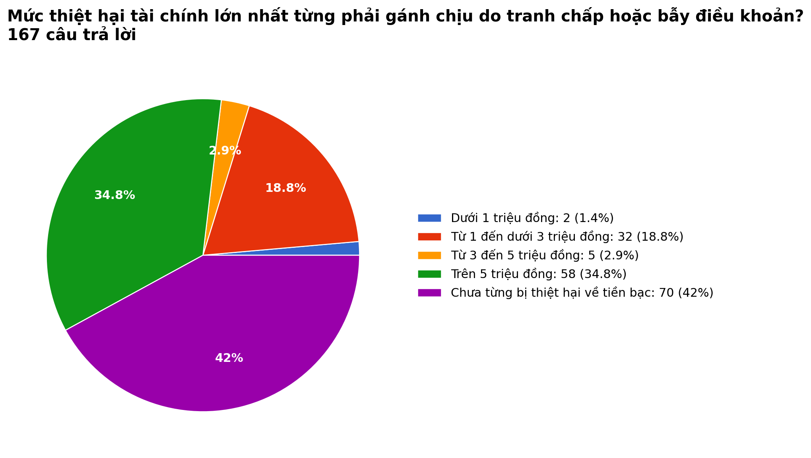

Hình KS7: Biểu đồ khảo sát do nhóm thực hiện (n = 167).

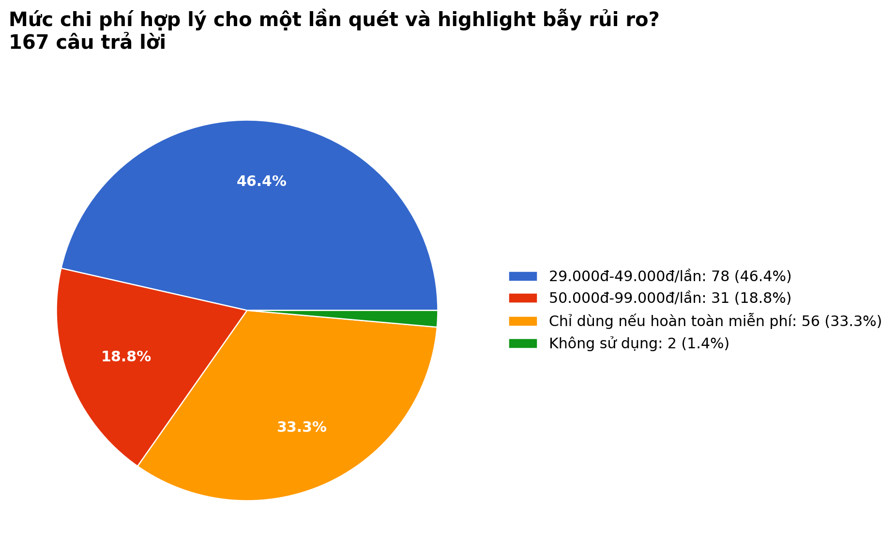

Hình KS8: Biểu đồ khảo sát do nhóm thực hiện (n = 167).